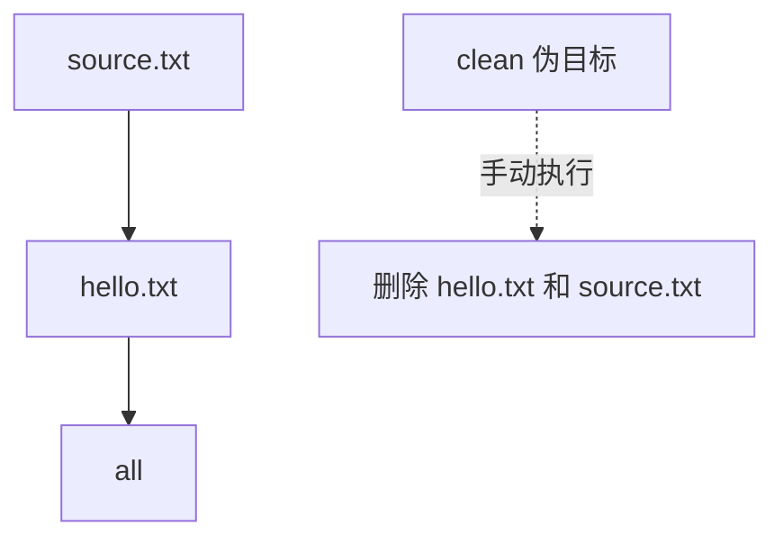

# Makefile解决的问题与第一个例子

## 学习目标

本篇从零开始回答一个最基础的问题：Makefile 到底解决什么问题。读完后，读者应该能写出第一个可运行的 Makefile，能解释目标（target）、前置条件（prerequisite）、配方（recipe）三者的关系，并能通过 `make -n` 和 `make --trace` 观察 Make 为什么执行或跳过某个命令。

Makefile 的核心价值不是“少敲几行命令”，而是把工程产物之间的依赖关系写清楚。普通 shell 脚本通常按顺序重跑所有步骤；Make 会检查目标文件和依赖文件的修改时间，只重建过期的那一部分。这一点在数字IC工程里尤其重要：一次完整仿真、综合或覆盖率合并可能很慢，增量重跑能节省大量时间。

## 前置知识

- 会在终端进入一个目录并运行命令。
- 知道文件有修改时间；新文件通常比旧文件“更新”。
- 后续可继续阅读 [[tools/concepts/Makefile心智模型与历史|Makefile 心智模型与历史]] 和 [[tools/concepts/Makefile规则详解|Makefile 规则详解]]。

## 最小可运行例子

在一个空目录中创建名为 `Makefile` 的文件，复制下面内容。注意配方行前面必须是真实 TAB，不是空格。

```makefile
# 默认目标：用户只输入 make 时，GNU Make 会选择第一个普通目标
all: hello.txt                    # all 依赖 hello.txt；hello.txt 必须先被更新

# 真实文件目标：hello.txt 是磁盘上会生成的文件
hello.txt: source.txt             # hello.txt 依赖 source.txt；source 更新会触发重建
	@printf 'build from %s\n' "$<" > "$@"   # $< 是第一个前置条件；$@ 是当前目标
	@printf 'done at %s\n' "$$(date +%H:%M:%S)" >> "$@" # $$ 把 $ 留给 shell 的 date 命令

# 输入文件目标：source.txt 不存在时，用配方生成一个最小输入
source.txt:                       # 这个目标没有前置条件，只在文件缺失时执行
	@printf 'hello make\n' > "$@"  # $@ 展开为 source.txt，写入一行输入文本

# 伪目标声明：clean 是动作，不是要生成的真实文件
.PHONY: clean                     # 即使目录里有 clean 文件，make clean 也会执行
clean:                            # 清理目标，方便重复实验
	@rm -f hello.txt source.txt     # 删除构建产物和输入文件
```

执行命令：

```shell
# 清空上一次实验留下的文件，保证从确定状态开始
make clean
# 预演构建命令，只打印配方，不真正生成文件
make -n
# 执行构建并显示每条规则为什么被触发
make --trace
# 再执行一次，观察目标已经最新时 Make 不会重复生成 hello.txt
make --trace
# 修改输入文件时间戳，让 source.txt 比 hello.txt 新
sleep 1 && touch source.txt
# 再次执行，观察 hello.txt 因依赖更新而重建
make --trace
```

第一次 `make --trace` 会生成 `source.txt` 和 `hello.txt`。第二次 `make --trace` 通常只会报告 `all` 目标已满足，不会重新执行生成 `hello.txt` 的配方。`touch source.txt` 之后，依赖文件比目标文件新，Make 才会重新执行 `hello.txt` 的配方。

## 语法拆解

- `all: hello.txt` 是一条规则；冒号左侧是目标，右侧是前置条件。
- `hello.txt: source.txt` 表示 `hello.txt` 的正确性依赖 `source.txt`。
- 以 TAB 开头的两行是 `hello.txt` 的配方；配方由 shell 执行。
- `$@` 是 Make 自动变量，表示当前目标名；这里是 `hello.txt` 或 `source.txt`。
- `$<` 是 Make 自动变量，表示第一个前置条件；这里是 `source.txt`。
- `$$` 表示把一个 `$` 交给 shell；如果只写 `$`，会先被 Make 当成变量展开。
- `.PHONY: clean` 表示 `clean` 是伪目标（phony target），永远按动作处理。
- `@` 前缀表示不回显配方本身，让示例输出更干净。

## 执行轨迹



Make 的执行可以拆成两层：先读取 Makefile，建立规则和变量数据库；再从用户请求的目标开始，递归检查依赖是否需要更新。用户只输入 `make` 时，默认目标是第一个普通目标 `all`，于是 Make 先检查 `hello.txt`，再检查 `source.txt`。

这个模型和普通 shell 脚本不同。shell 脚本通常是“第一行、第二行、第三行”顺序执行；Makefile 是“为了更新目标，需要先满足哪些依赖”。因此，Make 更适合描述产物网络，而不是描述一次性命令流水账。

## 工程化写法

真实项目会把 `source.txt` 换成源代码、RTL 文件、约束文件或 testlist，把 `hello.txt` 换成对象文件、仿真日志、综合报告或覆盖率数据库。只要这些产物能落到文件系统里，就可以被 Make 当作目标管理。

数字IC流程中常见目标包括 `sim.log`、`regress.pass`、`syn/qor.rpt`、`cov/merged.ucdb`。如果 Makefile 正确写出它们和输入文件之间的依赖关系，工程师就可以只重跑受影响的步骤，而不是每次从头开始。

## 常见错误

| 错误现象 | 根因 | 修复 |
|:---|:---|:---|
| `missing separator` | 配方行用了空格而不是真实 TAB | 使用真实 TAB，或在高级场景中设置 `.RECIPEPREFIX` |
| 第二次 `make` 仍然重建 | 目标不是文件，或配方总是更新依赖 | 区分真实文件目标和 `.PHONY` 目标 |
| 修改输入后没有重建 | 输入文件没有列在前置条件中 | 把真实输入写到目标右侧依赖列表 |

## 关键要点

- Makefile 的第一核心是依赖关系，不是命令缩写。
- 第一个普通目标是默认目标，常用 `all` 作为入口。
- 真实文件目标是否重建主要由目标和依赖的时间戳决定。
- 配方由 shell 执行，但配方中的 `$@`、`$<` 等先由 Make 展开。
- `make -n` 用于预演，`make --trace` 用于解释触发原因。
- `.PHONY` 应用于动作目标，例如 `clean`、`test`、`help`。

## 与其他概念的关系

- [[tools/concepts/Makefile心智模型与历史|Makefile 心智模型与历史]]：进一步解释 DAG 和二阶段执行模型。
- [[tools/concepts/Makefile规则详解|Makefile 规则详解]]：系统拆解 target、prerequisite、recipe。
- [[tools/工具与脚本|工具与脚本]]：本系列所在的工具领域内容地图。

## 小练习

1. 把 `hello.txt` 改名为 `report.txt`，观察 `$@` 输出如何变化。
2. 删除 `source.txt` 后运行 `make --trace`，解释 Make 为什么先生成输入文件。
3. 创建一个名为 `clean` 的普通文件，再删除 `.PHONY: clean`，观察 `make clean` 的行为差异。
