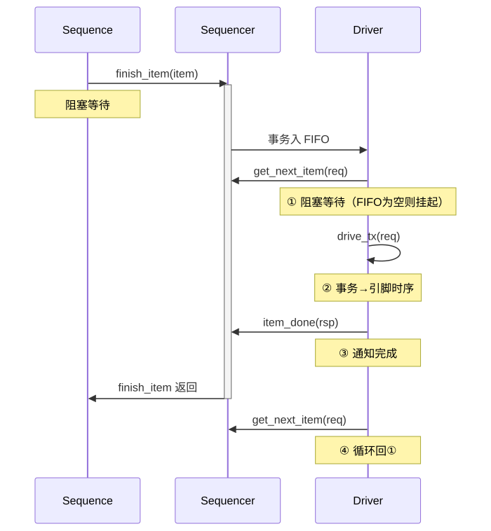

# UVM 方法学

通用验证方法学（Universal Verification Methodology, UVM）是集成电路功能验证领域事实上的工业标准方法学，由 Accellera 标准化并纳入 IEEE 1800.2-2020。UVM 基于 SystemVerilog 构建，提供了一套完整的类库（Class Library）和验证架构框架，覆盖从块级（Block-Level）到芯片级（Chip-Level）乃至系统级（System-Level）的验证需求。其核心设计理念是通过工厂模式（Factory Pattern）和配置机制（Configuration Mechanism）实现验证组件的高度可重用性和可扩展性。

## 原理

### 类库层次与工厂机制

UVM 的类库层次分为两大分支：以 `uvm_object` 为根的数据对象分支（Sequence Item、Sequence、Configuration 等）和以 `uvm_component` 为根的静态结构分支（Driver、Monitor、Scoreboard、Agent、Environment、Test 等）。`uvm_component` 具有父子层次关系和 Phase 执行机制，而 `uvm_object` 则是轻量级的数据容器。工厂机制（Factory）是 UVM 最核心的设计模式之一：通过 `uvm_factory` 单例，用户可以在不修改现有验证环境代码的前提下，将某个类型的所有实例替换为其子类实现。工厂注册使用宏 `` `uvm_object_utils`` 和 `` `uvm_component_utils``，类型覆盖通过 `set_type_override_by_type()` 或 `set_inst_override_by_type()` 实现，配合 `create()` 方法替代 `new()` 构造函数。这一设计使得验证 IP（VIP）的外部定制和项目间复用成为可能。

配置数据库（Configuration Database, config_db）是 UVM 的另一个关键机制，通过 `uvm_config_db #(T)::set()` 和 `get()` 方法实现验证环境中任意节点间的键值对传递。config_db 采用层次化查找策略：`get()` 调用会从当前组件开始，沿层次树向上追溯到 root，检查键名和路径的通配匹配。config_db 解决了传统验证中全局变量或参数传递带来的耦合问题，常用于传递虚拟接口（Virtual Interface）、Agent 配置（active/passive 模式）、覆盖率使能标志等。config_db 的 `set()` 必须在 `build_phase` 之前或之中完成，而 `get()` 通常发生在 `build_phase` 内，这一时序约束是 UVM Phase 机制的核心保障。

### UVM Phase 机制

UVM 将仿真生命周期划分为一组严格有序的 Phase，确保所有验证组件在统一的时间点上执行初始化、连接和运行操作。最关键的三个 Phase 组是：(1) **Build Phases**（`build_phase`、`connect_phase`、`end_of_elaboration_phase`）——自顶向下构建组件树，然后自底向上完成连接；(2) **Run Phases**——`run_phase` 与 12 个细分 Run-Time Phase（`reset_phase`、`configure_phase`、`main_phase`、`shutdown_phase`）并行执行，允许不同组件在不同 Phase 阶段做不同的事；(3) **Cleanup Phases**（`extract_phase`、`check_phase`、`report_phase`）——收集验证结果和输出报告。Phase 的严格同步通过 `uvm_domain` 和 `uvm_phase` 的 `raise_objection`/`drop_objection` 机制实现：`run_phase` 不会结束直到所有 objection 都已被 drop，这保证仿真不会在激励未发送完毕或检查未完成时提前终止。

### TLM 通信与 Sequence 机制

事务级建模（Transaction Level Modeling, TLM）是 UVM 组件间通信的标准方式。TLM 定义了 Port、Export 和 Imp（Implementation）三种端口角色：Port 是发起端（调用方法方），Export 是中间转发端，Imp 是最终的实现端。TLM 接口方法包括 `put()`、`get()`、`transport()`、`write()` 等，以及对应的 `try_*` 和非阻塞 `nb_*` 变体。`uvm_tlm_analysis_fifo` 是 Monitor 到 Scoreboard 的广播通信中最常用的组件，实现了一个无限深度的 TLM FIFO，允许多个 writer 写入，多个 subscriber 通过 `analysis_port` 独立读取。Sequence → Sequencer → Driver 流水线是 UVM 激励生成的标准范式：Sequence 产生 `uvm_sequence_item` 事务对象，通过 `start()` 方法将其发送到 Sequencer；Sequencer 作为仲裁器管理多个 Sequence 的请求队列；Driver 通过 `seq_item_port.get_next_item()` 从 Sequencer 获取下一个事务，将其转换为 DUT 接口上的引脚级信号时序，完成后调用 `item_done()`。这一流水线将事务级抽象与信号级实现完全解耦。

对于多接口协议协同验证场景，Virtual Sequencer 提供了不直接连接 Driver 的虚拟调度层。通过在 Virtual Sequence 中实例化多个子 Sequencer 的句柄，并在 `body()` 任务中协调各子 Sequence 的执行（串行或并行启动、同步等待等），实现跨接口的复杂测试场景编排。典型的 Virtual Sequence 在 `body()` 中通过 `fork...join` 并行启动子 Sequence，并使用 `grab_lock` / `ungrab_lock` 机制确保关键操作（如寄存器配置后启动传输）不被其他 Sequence 的事务插入打断。

### Sequence 分层与仲裁策略

UVM 推荐将 Sequence 按照抽象层级分层组织：底层 API Sequence（`axi_write_seq`、`apb_read_seq`）封装单次总线操作的事务生成逻辑；中间层 Functional Sequence（`dma_config_seq`、`mem_fill_seq`）组合多个 API Sequence 完成一个功能单元；顶层 Scenario Sequence（`dma_full_test_seq`）协调多个 Functional Sequence 实现完整测试场景。这种分层使得低层 Sequence 可在不同测试场景间复用而不需修改。

Sequencer 的仲裁策略通过 `set_arbitration()` 配置，支持 SEQ_ARB_FIFO（先进先出）、SEQ_ARB_WEIGHTED（权重轮询）、SEQ_ARB_RANDOM（随机）、SEQ_ARB_STRICT_FIFO（严格 FIFO，不考虑优先级）、SEQ_ARB_STRICT_RANDOM（严格随机）和 SEQ_ARB_USER（用户自定义）等多种模式。当多个并行 Sequence 同时有事务待发送时，仲裁策略决定 Driver 的调度顺序——这在多通道 DMA 验证中尤为重要，因为不同通道的 Sequence 优先级直接影响 DUT 的行为正确性。

### UVM 通信的高级模式

除了 TLM FIFO 的广播模式外，UVM 还支持点对点的 TLM 连接用于确定性通信。`uvm_tlm_req_rsp_channel` 封装了 `put()` + `get()` 的双向请求-响应通道，允许组件在发送请求后同步等待响应——这对于需要握手确认的验证逻辑（如 Scoreboard 向 Reference Model 查询预期结果）很有用。`uvm_blocking_transport_port` 和 `uvm_non_blocking_transport_port` 则提供更通用的传输接口，支持阻塞和非阻塞两种通信语义。

### 资源数据库（Resource Database）

除 config_db 外，UVM 1.2 引入了资源数据库（`uvm_resource_db`）作为更灵活的配置传递机制。与 config_db 的层次化作用域不同，resource_db 提供全局平面化的键值存储，不受组件层次约束。resource_db 适用于需要在测试环境中全局共享且不涉及特定组件层次的数据——如全局测试参数、随机种子值、DUT 拓扑信息等。config_db 和 resource_db 可以并存使用，`uvm_config_db::set()` 内部实际上同时向 resource_db 写入数据，而 `get()` 先从 config_db 查找再从 resource_db 查找。

### UVM Report 机制

UVM 的报告机制通过 `uvm_report_handler` 和 `uvm_report_server` 两级结构实现。`uvm_info`/`uvm_warning`/`uvm_error`/`uvm_fatal` 四个宏是主要的报告接口，每个宏支持 verbosity 过滤（`UVM_NONE` 到 `UVM_DEBUG` 共 6 级）、ID 标签、消息体和动作控制。`uvm_report_server` 的 `set_max_quit_count()` 方法设置在仿真因错误退出前允许的 `uvm_error` 最大数量——这是控制"fail fast"行为的关键参数，通常设为 5-10 以在回归测试中快速暴露致命问题而不浪费仿真机时。

### Objection 与仿真终止

UVM 的 Objection 机制是控制仿真生命周期终止的核心：`run_phase` 和所有 12 个 Run-Time Phase 在进入时自动启动，但不会自动结束——必须等待该 Phase 中所有 `raise_objection` 和 `drop_objection` 配对完成。`uvm_objection` 对象维护每个 Phase 的挂起 objection 计数；当计数降为零时 Phase 结束。常见的 Objection 管理方式包括：(1) 在 `uvm_sequence_base` 的 `pre_start()` 和 `post_start()` 中通过配置标志自动 raise/drop objection，减少手动操作；(2) 在 Scoreboard 中 raise objection 直到所有期望事务都被检查完成；(3) 使用看门狗定时器（Watchdog Timer）——在 `run_phase` 中启动定时任务，超时后无条件清空所有 objection 并报 `UVM_FATAL`，防止仿真无限制挂起。

### Callback 机制与扩展点

UVM 的 Callback（回调）机制提供了一种非侵入式的扩展方式：通过 `uvm_callback` 基类和 `` `uvm_register_cb`` 宏，用户可以在 UVM 组件的关键执行点（如 Driver 的事务处理前后、Monitor 的事务广播前后）注册回调函数，注入自定义行为而不需修改原始组件代码。例如在 `uvm_driver::put_response()` 前注册一个错误注入回调，在特定条件下将已发送事务的某个字段篡改为错误值以测试 Scoreboard 的检错能力。Callback 的优势在于不与 Factory Override 产生冲突——Factory Override 替换整个组件类型，而 Callback 只是附加行为；两者可以同时使用。

### RAL 前门访问的适配流程

RAL 前门访问的完整流程为：`uvm_reg::write()` → `uvm_reg_map::do_write()` → `reg_adapter::reg2bus()`（将 `uvm_reg_bus_op` 转换为总线 Sequence Item）→ 将 Sequence Item 发送到 Bus Sequencer → Bus Driver 驱动总线协议信号 → 等待总线响应 → `reg_adapter::bus2reg()`（将总线响应 Sequence Item 转换回 `uvm_reg_bus_op`）→ 返回状态码。后门访问则绕过总线直接通过 HDL 路径（`uvm_hdl_read()`/`uvm_hdl_deposit()`）访问寄存器值，仅需 `add_hdl_path()` 和 `add_hdl_path_slice()` 设置 DUT 路径映射。RAL 的 `predict()` 方法允许在仿真中直接更新镜像值而不发起总线访问——适用于已知硬件行为但不想发送冗余总线事务的场景。

### 寄存器抽象层（Register Abstraction Layer, RAL）

UVM RAL 提供了一套面向对象的寄存器建模和访问框架。用户通过 `uvm_reg_field`、`uvm_reg`、`uvm_reg_block` 等类构建与硬件寄存器映射（Register Map）一一对应的镜像模型。RAL 提供 `read()`/`write()` 前门访问（通过 Bus Sequencer 发送总线事务）和后门访问（通过 HDL 路径直接读写）两种方式，并自动维护期望值（Desired Value）和镜像值（Mirror Value），通过 `mirror()` 或 `update()` 方法实现硬件状态与模型的一致性检查和同步。RAL 内建 Coverage（寄存器域覆盖率收集）和 Memory 建模（`uvm_mem`）以支持配置空间验证和存储控制器验证。

### UVM Phase 机制

UVM 将仿真生命周期划分为一组严格有序的 Phase（阶段），确保所有验证组件在统一的时间点上执行初始化、连接和运行操作。Phase 机制的设计目的是解决 OVM 中组件初始化顺序不确定导致的环境构建竞态问题。

**三大 Phase 组及各自 Phase：**

| Phase 组 | Phase 名称 | 执行顺序 | 函数/任务 | 典型用途 |
|:---|:---|:---|:---|:---|
| **Build** | `build_phase` | 自顶向下 | function | 用 `create()` 实例化子组件，`config_db::get()` 获取配置 |
| | `connect_phase` | 自底向上 | function | 连接 TLM port/export/imp，连接 Virtual Interface |
| | `end_of_elaboration_phase` | 自底向上 | function | 最终配置调整，打印环境拓扑，检查连接完整性 |
| **Run** | `start_of_simulation_phase` | 自底向上 | function | 仿真开始前的最后一次初始化（打印 banner、打开日志文件） |
| | `run_phase` | 并行 | **task** | 主要的激励生成和 DUT 交互（消耗仿真时间） |
| | `reset_phase` | 并行 | task | DUT 复位阶段的特定行为 |
| | `configure_phase` | 并行 | task | DUT 配置阶段的特定行为（编程寄存器等） |
| | `main_phase` | 并行 | task | 核心测试场景执行 |
| | `shutdown_phase` | 并行 | task | DUT 关闭/低功耗进入等结束行为 |
| **Cleanup** | `extract_phase` | 自底向上 | function | 从 Scoreboard/Monitor 提取数据（覆盖率、性能计数等） |
| | `check_phase` | 自底向上 | function | 最终正确性检查（Scoreboard Drain 检查、队列清空验证） |
| | `report_phase` | 自底向上 | function | 输出测试报告、Pass/Fail 判定 |
| | `final_phase` | 自顶向下 | function | 仿真终止前的最后清理（关闭文件、释放资源） |

**Phase Objection 机制：**

Objection 是控制 `run_phase` 和各 Run-Time Phase 何时结束的唯一手段。原理：每个 Phase 进入时自动启动，但不会自动结束——必须等待该 Phase 中所有的 `raise_objection` 和 `drop_objection` 配对完成。

```systemverilog
// ===== Phase Objection 控制仿真生命周期 =====
// uvm_test 派生类：具体的测试用例
class my_test extends uvm_test;
    `uvm_component_utils(my_test)          // 工厂注册宏：将类注册到 UVM 工厂

    task run_phase(uvm_phase phase);       // run_phase 任务：消耗仿真时间
        super.run_phase(phase);            // 调用父类的 run_phase（可选，保留默认行为）

        // phase.raise_objection(this):
        //   向当前 phase 的 objection 管理器注册一个 objection
        //   this: 引用当前组件对象——记账"这个组件还有未完成的工作"
        //   效果：phase 的挂起 objection 计数 +1
        phase.raise_objection(this);       // 告诉 UVM："我还有工作要做，别急着结束仿真"

        // seq.start(sequencer):
        //   启动 Sequence 对象，将其事务发送到指定 Sequencer
        //   sequencer 句柄通过 config_db 或层次路径引用获取
        my_sequence seq = my_sequence::type_id::create("seq");
        seq.start(env.virt_seqr);          // 在 Virtual Sequencer 上启动顶层 Sequence

        // phase.drop_objection(this):
        //   解除当前组件对当前 phase 的 objection
        //   效果：phase 的挂起 objection 计数 -1
        //   当所有 objection 都被 drop 后（计数归零），phase 自动结束
        phase.drop_objection(this);        // 告诉 UVM："我的工作做完了，可以结束了"
    endtask
endclass
```

**不 raise objection 会怎样？**
- `run_phase` 进入后**立即退出**（因为挂起 objection 计数为 0）
- 测试在开始任何实际操作之前就"结束"了
- 最常见的症状：仿真瞬间完成，波形为空，所有覆盖率为 0%
- 这是 UVM 初学者常见的配置遗漏——忘了 raise objection 导致仿真立即终止

**`run_phase` 和 12 个细分 Run-Time Phase 的关系：**

两者**并行执行**，但各自有独立的 Objection 控制。`run_phase` 在所有 12 个 sub-phase 启动时同时启动，在 12 个 sub-phase 全部结束后才结束。典型的分工策略：
- `run_phase` 用于不需要精细阶段控制的简单激励（大多数测试用例只用这个）
- Sub-phase（`reset_phase`/`configure_phase`/`main_phase`/`shutdown_phase`）用于需要按阶段精确控制 DUT 行为的复杂场景（如功耗验证需要精确控制何时进入/退出低功耗模式）

**Phase 跳转：**

UVM 支持 Phase 跳转（Phase Jump），通过 `phase.jump()` 方法实现。典型的跳转场景是错误恢复：`main_phase` 中检测到致命错误后跳转回 `reset_phase` 重新初始化 DUT 而非直接终止仿真。

```systemverilog
// ===== Phase 跳转：错误恢复场景 =====
task main_phase(uvm_phase phase);
    // 执行核心测试逻辑
    if (fatal_error_detected) begin
        `uvm_warning("PHASE_JUMP", "Fatal error detected, jumping back to reset_phase")
        // phase.jump(目标phase): 从当前 phase 直接跳转到指定的 phase
        //   跳转后：reset_phase → configure_phase → main_phase 重新执行一次完整的运行周期
        //   适用场景：错误恢复、DUT 状态异常时的自动重试
        phase.jump(uvm_reset_phase::get());  // 跳转回 reset_phase 从头开始
    end
endtask
```

**UVM 相比 OVM 的改进：**

| 方面 | OVM | UVM |
|:---|:---|:---|
| **Phase 名称不一致** | `build`/`connect`/`run` | 统一 `_phase` 后缀，增加 `start_of_simulation_phase` |
| **Objection 作用域** | 仅 `run` 任务 | 所有 12 个 Run-Time Phase 各自独立管理 |
| **Phase 跳转** | 不支持 | 支持 `phase.jump()` 运行时跳转 |
| **资源数据库** | 仅 config-db 层次查找 | 增加 `uvm_resource_db` 全局平面键值存储 |
| **Callback 注册** | 手动，繁琐 | `uvm_callback` 基类 + `` `uvm_register_cb`` 宏，标准化 |
| **标准规范** | Accellera 内部标准 | IEEE 1800.2-2020 国际标准 |
| **工厂宏** | 非标准，各供应商不同 | `` `uvm_component_utils`` / `` `uvm_object_utils`` 统一标准 |

### uvm_component 和 uvm_object 的区别

`uvm_component` 和 `uvm_object` 是 UVM 类库层次的两个根类，它们决定了 UVM 中所有类的本质行为。

**核心区别对比：**

| 维度 | `uvm_component` | `uvm_object` |
|:---|:---|:---|
| **层次关系** | 有父子层次（parent-child），形成组件树 | 无层次关系，独立存在（或临时挂载到某 component 上） |
| **生命周期** | 静态（仿真全程存在），在 `build_phase` 中创建后持续到仿真结束 | 动态（可随时创建和销毁），每个事务用完即可丢弃 |
| **Phase 机制** | 参与 Phase 执行（自动调用 build/connect/run/check 等回调） | 不参与 Phase 机制 |
| **`new()` 参数** | **必须有 parent 参数**：`function new(string name, uvm_component parent)` | **只需 name 参数**：`function new(string name = "")` |
| **工厂创建位置** | 必须在 `build_phase` 中通过 `create()` 创建 | 可在任何位置通过 `create()` 或在 Sequence 的 `body()` 中创建 |
| **配置访问** | 天然支持 `config_db::get()` / `set()` | 可通过 `uvm_resource_db` 或自身 `m_set_full_name()` 后使用 config_db |
| **典型子类** | Driver, Monitor, Sequencer, Scoreboard, Agent, Env, Test | Sequence Item (Transaction), Sequence (非 component), Configuration, RegModel |
| **工厂宏** | `` `uvm_component_utils`` | `` `uvm_object_utils`` |

**为什么 component 在 build_phase 创建？**

`build_phase` 是 UVM Phase 机制中唯一**自顶向下**执行的 Build Phase——父组件先于子组件执行。这样设计的好处：
1. **config_db 的 set/get 时序**：`set()` 通常在父组件的 `build_phase` 中执行，`get()` 在子组件的 `build_phase` 中执行，自顶向下的顺序保证子组件在 `get()` 时父组件已经完成 `set()`
2. **组件树一次性构建**：所有静态组件在仿真时间 0 之前就全部创建完毕，后续的 connect/run phase 操作在已知的完整组件树上进行

```systemverilog
// ===== uvm_component 的 build_phase：自顶向下创建组件树 =====
class my_env extends uvm_env;
    `uvm_component_utils(my_env)          // 工厂注册：uvm_component 专用宏

    my_agent agent_0;                      // 子组件句柄声明（尚未创建实例）

    // function new: uvm_component 构造函数的参数签名
    //   name:   组件实例名（字符串），用于层次路径构造
    //   parent: 父组件引用（uvm_component 类型），用于建立父子层次关系
    //           必须是 uvm_component（不能是 uvm_object），因为只有 component 有层次
    function new(string name, uvm_component parent);
        super.new(name, parent);           // 调用父类（uvm_env）的构造函数
    endfunction

    // build_phase: 在此 phase 中实例化所有子组件
    //   此 phase 执行时 parent 已经完全构建好（config_db set 已生效）
    function void build_phase(uvm_phase phase);
        super.build_phase(phase);          // 先调用父类 build_phase（保留默认行为）

        // type_id::create(name, parent):
        //   工厂方法——替代 new() 来创建组件实例
        //   name: 实例名（字符串，必须与句柄变量名一致以避免命名冲突）
        //   parent: 传入 this（当前 env 实例），建立 "env → agent" 的父子关系
        //   为什么用 create() 而非 new()：
        //     create() 会查询工厂表——如果外部做了 override，
        //     实际创建的可能是 my_agent 的子类（如 my_agent_extended）
        //     而 new() 直接构造指定类型，绕过了工厂机制
        agent_0 = my_agent::type_id::create("agent_0", this);

        // config_db::get(): 在 build_phase 中获取配置参数
        //   此时父组件的 set() 已经完成（自顶向下），get() 能安全获取到值
        if (!uvm_config_db #(virtual my_if)::get(this, "", "vif", agent_0.vif))
            `uvm_fatal("CFG", "Virtual interface not set for agent_0")
    endfunction
endclass
```

**为什么 new 需要 parent 参数？**

父组件参数 `parent` 是 UVM 组件树的构建基础：
1. **层次路径生成**：每个 component 的完整层次路径由 `parent.get_full_name() + "." + name` 自动拼接，例如 `"uvm_test_top.env.agent_0.driver"`——这用于 config_db 的路径匹配、日志标识和调试定位
2. **自动内存管理**：父组件在其析构时自动释放子组件，无需手动管理
3. **config_db 查找锚点**：`get()` 的自动层次查找从当前组件开始沿 parent 链向上追溯

**`uvm_transaction` 和 `uvm_sequence_item` 的关系：**

`uvm_transaction` 继承自 `uvm_object`，是事务基类，定义了 `accept_tr()`/`begin_tr()`/`end_tr()` 等事务记录方法，用于波形和日志中的事务可视化追踪。`uvm_sequence_item` 继承自 `uvm_transaction`，增加了 `set_sequencer()` / `get_sequencer()` 方法，使 item 能关联到产生它的 sequencer，以及 `set_item_context()` 用于序列层次上下文传递。工程实践中，几乎所有自定义 Transaction 类都继承自 `uvm_sequence_item`（而非 `uvm_transaction`），因为需要与 Sequencer-Driver 流水线集成。

**Sequence 是 component 还是 object？**

Sequence 继承自 `uvm_sequence`，而 `uvm_sequence` 继承自 `uvm_sequence_base`，最终根类是 `uvm_object`——所以 **Sequence 是 object，不是 component**。这意味着：
- Sequence 是**动态的**：每次测试可以创建不同的 Sequence 实例，用完即销毁
- Sequence **不参与 Phase 机制**：它在 `body()` 任务中自主运行，与 Component 的 Phase 生命周期独立
- Sequence 可以**在 `body()` 中 `raise_objection` / `drop_objection`**：虽然 Sequence 不是 component，但它可以通过 `starting_phase` 间接控制当前 Phase 的 Objection

**config_db 给 object 传配置：**

虽然 config_db 主要面向 component，但也可以给 object 传递配置：

```systemverilog
// ===== config_db 给 uvm_object 传配置的两种方式 =====
class my_config extends uvm_object;       // 配置对象（继承自 uvm_object）
    rand int timeout;
    `uvm_object_utils(my_config)
endclass

// 方式 1：通过其创建时的 component context 查询
//   在 Sequence 的 body() 中——Sequence 通过 get_sequencer() 获得其所在的 component context
my_config cfg;
if (!uvm_config_db #(my_config)::get(m_sequencer, "", "cfg", cfg))
    `uvm_error("CFG", "config not found for sequence")

// 方式 2：使用 resource_db（推荐——不依赖 component 层次）
//   需要先给 object 设置 full_name（通过挂载到某个 component 或手动设置 context）
uvm_resource_db #(my_config)::set("GLOBAL", "shared_cfg", cfg_obj);
```

### UVM Factory 机制

Factory（工厂）是 UVM 最核心的设计模式之一。它的本质是用一个全局注册表（Registry）替代直接构造函数调用，实现类型的动态替换——这是验证 IP 可配置性和可复用性的技术基础。

**Factory 的核心作用：**

1. **类型覆盖（Type Override）**：在不修改现有验证环境代码的前提下，将某个类型的所有实例或特定实例替换为其子类实现
2. **实例级替换**：可以精确控制替换范围——"替换所有 AXI Master Agent" vs "只替换 DMA 通道的 AXI Master Agent"
3. **测试用例差异化**：同一个验证环境，不同测试通过 Factory Override 实现不同的组件行为——如错误注入 Driver、特殊配置 Monitor 等

```systemverilog
// ===== Factory 机制：注册、创建、覆盖三部曲 =====

// ── 步骤 1：定义一个可被覆盖的基类 ──
// `uvm_component_utils: 工厂注册宏——将类的基本信息注册到全局工厂表中
//   注册的内容包括：类名、类型 ID（`get_type()`）、创建函数指针（`create()`）
class my_driver extends uvm_driver #(my_item);
    `uvm_component_utils(my_driver)      // 工厂注册：使得 create() 方法可用

    function new(string name, uvm_component parent);
        super.new(name, parent);
    endfunction

    task run_phase(uvm_phase phase);
        // 标准驱动行为：获取事务 → 驱动信号 → 确认完成
        forever begin
            seq_item_port.get_next_item(req);
            drive_transfer(req);         // 驱动 DUT 信号（标准行为）
            seq_item_port.item_done();
        end
    endtask
endclass

// ── 步骤 2：定义扩展类（带错误注入的子类）──
// extends my_driver: 继承标准 Driver，复用其所有接口和连接
class my_driver_error extends my_driver;
    `uvm_component_utils(my_driver_error) // 子类也需要独立注册到工厂

    function new(string name, uvm_component parent);
        super.new(name, parent);
    endfunction

    task run_phase(uvm_phase phase);
        forever begin
            seq_item_port.get_next_item(req);
            // 以 5% 的概率注入错误——翻转数据的第 0 位
            if ($urandom_range(0, 99) < 5)    // 0-4 共 5 个数 → 5% 概率
                req.data[0] = ~req.data[0];    // 位翻转：0→1 或 1→0
            drive_transfer(req);
            seq_item_port.item_done();
        end
    endtask
endclass

// ── 步骤 3：在 Testcase 中通过 Factory Override 替换组件 ──
class my_test_with_error_injection extends uvm_test;
    `uvm_component_utils(my_test_with_error_injection)

    function void build_phase(uvm_phase phase);
        super.build_phase(phase);

        // 方法 A：类型覆盖——该类型的所有实例都被替换
        // set_type_override_by_type(原始类型::get_type(), 替换类型::get_type());
        //   效果：环境中所有 my_driver 类型的实例都会被替换为 my_driver_error
        set_type_override_by_type(
            my_driver::get_type(),           // 要被替换的原始类型
            my_driver_error::get_type()      // 替换后的新类型
        );

        // 方法 B：实例覆盖——只替换特定路径下的特定实例
        // set_inst_override_by_type(原始类型, 替换类型, 实例路径);
        //   效果：只有路径匹配 "env.agent_dma.*" 的 my_driver 实例被替换
        set_inst_override_by_type(
            my_driver::get_type(),
            my_driver_error::get_type(),
            "env.agent_dma.*"                // 通配符路径：只覆盖 DMA Agent 内的 driver
        );
    endfunction
endclass
```

**Factory 与 `new()` 的关键区别：**

| 调用方式 | 行为 | 是否可被 Override |
|:---|:---|:---|
| `my_type::type_id::create("name", parent)` | 查工厂表 → 如存在 override 则创建替换类型 | **是** |
| `new("name", parent)` | 直接构造指定类型 | **否** |

这就是为什么 UVM 组件的实例化**必须**使用 `create()` 而非 `new()`——使用 `new()` 等于放弃了 Factory Override 能力，破坏了验证 IP 的可配置性。

### TLM — put/get/transport 接口

TLM（Transaction Level Modeling，事务级建模）是 UVM 组件间通信的标准方式，其核心思想是：**组件之间不通过信号线连接，而是通过传递事务对象（Transaction）来通信**。TLM 将通信从信号级抽象提升到事务级。

**TLM 端口角色：**

| 角色 | SystemVerilog 类 | 职责 |
|:---|:---|:---|
| **Port**（发起端） | `uvm_*_port` | 发起通信的一方（调用方法方），如 Driver 的 `seq_item_port` |
| **Export**（转发端） | `uvm_*_export` | 中间转发——将调用传递给下游的 Imp |
| **Imp**（实现端） | `uvm_*_imp` | 最终实现通信方法的一方（提供方法体），如 Sequencer 的实现 |

**put/get/transport 三种接口对比：**

| 接口 | 方向 | 参数 | 阻塞/非阻塞 | 典型场景 |
|:---|:---|:---|:---|:---|
| **`put(trans)`** | Port → Imp（生产者→消费者） | 发送的事务对象 | `put()`(阻塞), `try_put()`(非阻塞), `can_put()`(询问) | Monitor 向 Scoreboard 发送观测到的事务 |
| **`get(output trans)`** | Port → Imp（消费者→生产者） | 返回的事务对象 | `get()`(阻塞), `try_get()`(非阻塞), `can_get()`(询问) | Driver 从 Sequencer 获取下一个待发送的事务 |
| **`transport(req, output rsp)`** | Port → Imp（双向，请求→响应） | 请求事务 + 响应事务 | `transport()`(阻塞), `nb_transport()`(非阻塞) | Scoreboard 向 Reference Model 查询预期值并等待返回 |

```systemverilog
// ===== TLM 三种接口的完整代码示例 =====

// --- put 接口：Monitor 向 Scoreboard 推送事务 ---
class my_monitor extends uvm_monitor;
    `uvm_component_utils(my_monitor)

    // uvm_analysis_port: 广播端口——可以向多个订阅者同时发送
    //   #(my_item): 参数化的端口类型——此端口传递 my_item 类型的事务
    //   与 put_port 的区别：analysis_port 不阻塞，不等待应答，
    //   支持多对多广播（多个 writer 写入同一 analysis_fifo）
    uvm_analysis_port #(my_item) ap;       // 声明分析端口（广播用）

    function void build_phase(uvm_phase phase);
        ap = new("ap", this);              // 实例化端口（必须使用 new，不是 create）
    endfunction

    task run_phase(uvm_phase phase);
        my_item item;
        forever begin
            // 采样 DUT 接口信号 → 组装事务 → 广播
            collect_transaction(item);     // 从 DUT 信号组装事务对象
            ap.write(item);                // write(): 广播事务给所有订阅者（非阻塞）
        end
    endtask
endclass

// --- get 接口：Driver 从 Sequencer 拉取事务 ---
class my_driver extends uvm_driver #(my_item);
    `uvm_component_utils(my_driver)

    task run_phase(uvm_phase phase);
        forever begin
            // seq_item_port.get_next_item(req):
            //   UVM 内建的 get 接口封装——底层调用 Sequencer 的 get() 方法
            //   阻塞等待：如果 Sequencer 中无待发事务，Driver 在此阻塞
            seq_item_port.get_next_item(req);  // 阻塞拉取下一个事务

            drive_transfer(req);               // 驱动 DUT 信号

            // seq_item_port.item_done():
            //   通知 Sequencer 当前事务已驱动完成，可以发送下一个
            //   底层调用 Sequencer 的 put_response() 方法
            seq_item_port.item_done();         // 确认完成
        end
    endtask
endclass

// --- transport 接口：Scoreboard 通过 Reference Model 查询 ---
// uvm_blocking_transport_port: 阻塞传输端口——发送请求并等待响应
//   对比 uvm_non_blocking_transport_port（非阻塞版本）
uvm_blocking_transport_port #(my_req, my_rsp) transport_port;
//                                   ^        ^
//                                   请求类型  响应类型
//   注意：transport 需要两个类型参数——请求类型和响应类型

task check_transaction(my_item actual_item);
    my_req req = my_req::type_id::create("req");
    my_rsp rsp;                              // 响应对象句柄

    req.addr = actual_item.addr;
    req.data = actual_item.data;

    // transport_port.transport(req, rsp):
    //   发送 req 给 Reference Model，阻塞等待返回 rsp
    //   底层完成：req → 协议转换 → Reference Model 计算 → 协议转换 → rsp 返回
    transport_port.transport(req, rsp);

    // 比对 DUT 的实际输出（actual_item）与 Reference Model 的预期输出（rsp）
    if (actual_item.result != rsp.expected_result)
        `uvm_error("CHK", $sformatf("Mismatch: got %h, expected %h",
                                     actual_item.result, rsp.expected_result))
endtask
```

**接口选择决策树：**
- 单向推送数据（Monitor → Scoreboard）→ `put()` / `write()`（analysis_port 的 write 是最常见的广播形式）
- 单向拉取数据（Driver ← Sequencer）→ `get()` 或 UVM 内建的 `seq_item_port` 封装
- 双向请求-响应（需要同步等待返回值）→ `transport()`
- 非关键路径不想阻塞 → 使用 `try_*` 或 `nb_*` 变体

### connect_phase — TLM 端口的连接时机与机制

`connect_phase` 是 UVM Build Phases 中的第二个阶段，在 `build_phase` 之后执行。它的唯一职责是**连接 TLM 端口**——将 Port 连到 Export，将 Export 连到 Imp，建立组件间的通信通道。

**1. 为什么需要 connect_phase？**

组件在 `build_phase` 中被创建（`create()`），但在 `build_phase` 结束前，子组件的内部端口尚未完全构建好。因此 UVM 设计了第二个阶段——`connect_phase`——专用于建立连接，且执行方向与 `build_phase` 相反：`build_phase` 自顶向下执行（父组件先于子组件），`connect_phase` 自底向上执行（叶子组件先完成连接，父组件后完成）。例如 `driver` 在自身的 `connect_phase` 中将 `seq_item_port` 连接到 `sequencer.seq_item_export`，`monitor` 将 `ap` 连接到 `agent.ap`，最后 `env` 将 `agent.ap` 连接到 `scoreboard.analysis_export`。

**connect_phase 的关键特性：**

| 特性        | 说明                                                          |
| :-------- | :---------------------------------------------------------- |
| **执行方向**  | **自底向上**（Bottom-Up）——叶子组件先完成连接，父组件后完成。与 build_phase 的自顶向下相反 |
| **执行性质**  | `function`（非 task，0 仿真时间）                                   |
| **唯一职责**  | 连接 TLM 端口（`port.connect(export)` 调用）                        |
| **不可做的事** | 不可 `create()` 组件；不可 `raise_objection`；不可消耗仿真时间              |

**2. Port/Export/Imp 的连接规则**

TLM 端口连接有严格的类型和方向约束，且必须在 `connect_phase` 中完成：

连接链（单向）：Port 发起端 → Export 中间转发 → Imp 最终实现


**约束：**

- Port 可以连接到 Export 或 Imp
- Export 只能连接到 Imp（不能连回 Port）
- Imp 是终端——不能再连接到其他端口
- 连接必须在 connect_phase 中完成（运行时不可改变）
- 端口类型必须匹配（`put_port` → `put_export`/`put_imp`，不能连到 `get` 端口）
- 参数化类型必须一致（`#(my_item)` 不能连 `#(other_item)`）

**3. connect_phase 的典型代码模式**

```systemverilog
// ===== Agent: 连接 Driver 到 Sequencer =====
class my_agent extends uvm_agent;
    my_driver    driver;         // 在 build_phase 中 create()
    my_sequencer sequencer;      // 在 build_phase 中 create()
    my_monitor   monitor;        // 在 build_phase 中 create()

    function void connect_phase(uvm_phase phase);
        super.connect_phase(phase);
        // ── seq_item_port (Port) → sequencer.seq_item_export (Export) ──
        // Driver 通过此连接从 Sequencer 阻塞拉取事务
        driver.seq_item_port.connect(sequencer.seq_item_export);

        // ── monitor.ap (Port) → agent 自身 ap (转发 Export) ──
        // Monitor 广播事务到 Agent 的分析端口，供外部 Env 连接
        monitor.ap.connect(this.ap);
    endfunction
endclass

// ===== Env: 跨层次连接 Agent 到 Scoreboard =====
class my_env extends uvm_env;
    my_agent      agent;         // 在 build_phase 中 create()
    my_scoreboard scoreboard;    // 在 build_phase 中 create()

    function void connect_phase(uvm_phase phase);
        super.connect_phase(phase);
        // ── agent.ap (Port) → scoreboard.analysis_export (Imp) ──
        // Monitor 发出的每个 write() 都到达 Scoreboard 的 FIFO
        agent.ap.connect(scoreboard.analysis_export);
    endfunction
endclass
```

**4. connect_phase 的常见错误**

| 错误 | 现象 | 修复 |
|:---|:---|:---|
| **在 build_phase 中做 connect** | 子组件端口尚未构造 → Null Handle → 仿真崩溃 | 移到 connect_phase |
| **忘记 super.connect_phase()** | 父类连接逻辑丢失——UVM 内建的 seq_item_port 等连接失效 | 确保每层调用 `super.connect_phase(phase)` |
| **在 connect_phase 中 create() 组件** | 违反 Build Phases 的职责分离——行为不可预测 | 移到 build_phase |
| **connect 方向写反** | `export.connect(port)` → 编译错误 | 始终 `port.connect(export)` |
| **类型不匹配** | 编译报错——参数化类型检查失败 | 检查 `#(type)` 是否一致 |

**5. 三个 Build Phase 的职责对比**

| 阶段 | 方向 | 职责 |
|:---|:---|:---|
| `build_phase` | 自顶向下 | `create()` 组件 + `config_db::get()` |
| `connect_phase` | 自底向上 | 连接 TLM 端口（`port.connect()`） |
| `end_of_elaboration_phase` | 自底向上 | 检查连接完整性——确认所有端口都已正确连接，虚拟接口不为 null |

### Sequence、Sequencer 与 Driver 的交互

Sequence 是激励的**生产者**，Sequencer 是激励的**仲裁器和调度器**，Driver 是激励的**消费者和执行者**。三者形成 UVM 激励生成的流水线（Pipeline）。

**各自职责：**

| 组件 | 基类 | 类型 | 职责 |
|:---|:---|:---|:---|
| **Sequence** | `uvm_sequence #(REQ,RSP)` | `uvm_object` | 定义事务的生成规则：随机化、循环、顺序、条件分支 |
| **Sequencer** | `uvm_sequencer #(REQ,RSP)` | `uvm_component` | 管理多个 Sequence 的请求队列，仲裁后将事务传递给 Driver |
| **Driver** | `uvm_driver #(REQ,RSP)` | `uvm_component` | 从 Sequencer 获取事务，将其拆解为引脚级信号时序，驱动 DUT |

**Driver-Sequencer 交互的完整流程：**



```systemverilog
// ===== Sequence 示例：产生 N 个随机内存读写事务 =====
// `uvm_object_utils: Sequence 是 object（不是 component），用 object 宏注册
class mem_sequence extends uvm_sequence #(mem_item);
    `uvm_object_utils(mem_sequence)

    rand int num_items = 20;               // 随机生成的事务数量（默认可被覆盖）

    // body(): Sequence 的主任务——定义事务生成逻辑
    //   当调用 seq.start(sequencer) 时，body() 自动执行
    task body();
        mem_item item;

        // starting_phase: 指向当前 Sequence 所在 Phase 的 objection 管理器句柄
        //   如果 starting_phase 非空（即 Sequence 是从 run_phase 中启动的），
        //   则 raise objection 防止仿真过早结束
        if (starting_phase != null)
            starting_phase.raise_objection(this);

        // repeat(N): 循环体执行 N 次——产生 num_items 个随机事务
        repeat (num_items) begin
            // type_id::create(): 通过工厂创建事务对象
            item = mem_item::type_id::create("item");

            // start_item(item):
            //   请求 Sequencer 允许发送 item——进入仲裁队列等待
            //   如果更高优先级的 Sequence 正在 grab lock，则阻塞等待
            start_item(item);

            // randomize(): 在 start_item 和 finish_item 之间随机化
            //   此时 item 已经获得了仲裁许可，随机化字段值
            if (!item.randomize())
                `uvm_fatal("RAND_FAIL", "Item randomization failed")

            // finish_item(item):
            //   将随机化后的事务最终发送到 Sequencer 的输出 FIFO 中
            //   然后阻塞等待 Driver 调用 item_done() 确认消费
            finish_item(item);
        end

        if (starting_phase != null)
            starting_phase.drop_objection(this);
    endtask
endclass
```

**Sequence 启动方式：**

```systemverilog
// 方式 1：在 Test 的 run_phase 中通过 start() 启动
//   default_sequence 方式——最常用
task run_phase(uvm_phase phase);
    mem_sequence seq = mem_sequence::type_id::create("seq");
    phase.raise_objection(this);
    seq.start(env.agent.sequencer);        // 在指定 Sequencer 上启动 Sequence
    phase.drop_objection(this);
endtask

// 方式 2：通过 config_db 配置 default_sequence（无需手动 raise objection）
//   在 build_phase 中设置——UVM 自动管理序列的启动和 objection
uvm_config_db #(uvm_object_wrapper)::set(
    this, "env.agent.sequencer.main_phase",
    "default_sequence", mem_sequence::get_type()
);
```

### Monitor 和 Scoreboard 的职责

Monitor（监视器）和 Scoreboard（计分板）是验证平台中两个职责截然不同的组件——Monitor 负责**观测**，Scoreboard 负责**判断**。

**Monitor 的职责：**

Monitor 是被动组件（Passive Component）——**只采样不驱动**。它对 DUT 接口信号进行持续采样，将信号级事件重新组装（Reassemble）为事务级对象，然后通过 `analysis_port` 广播给所有订阅者。

```systemverilog
// ===== Monitor：被动采样 DUT 信号，组装事务，广播 =====
class axi_monitor extends uvm_monitor;
    `uvm_component_utils(axi_monitor)

    virtual axi_if vif;                    // 虚拟接口：连接到 DUT 引脚
    uvm_analysis_port #(axi_item) ap;      // 分析端口：广播事务给 Scoreboard/Coverage

    function void build_phase(uvm_phase phase);
        ap = new("ap", this);
        // 从 config_db 获取虚拟接口句柄
        if (!uvm_config_db #(virtual axi_if)::get(this, "", "vif", vif))
            `uvm_fatal("CFG", "Virtual interface not set for monitor")
    endfunction

    task run_phase(uvm_phase phase);
        axi_item item;
        forever begin
            // 等待一次完整的 AXI 写事务完成（地址握手 + 数据握手 + 响应握手）
            @(posedge vif.clk);
            if (vif.awvalid && vif.awready) begin          // 写地址握手
                item = axi_item::type_id::create("item");
                item.addr = vif.awaddr;                     // 捕获地址
                item.len  = vif.awlen;                      // 捕获突发长度
                // ... 等待数据握手、响应握手，填充 item ...
                ap.write(item);                             // 广播事务给所有订阅者
            end
        end
    endtask
endclass
```

**Scoreboard 的职责：**

Scoreboard 是验证检查器——从多个 Monitor 接收事务，执行端到端数据比对，判断 DUT 行为是否与预期一致。

```systemverilog
// ===== Scoreboard：接收 Monitor 事务并比对 =====
class my_scoreboard extends uvm_scoreboard;
    `uvm_component_utils(my_scoreboard)

    // uvm_analysis_imp: 分析实现端口——接收来自 Monitor 的 write() 调用
    //   每个 Monitor 对应一个独立的 imp（通过 suffix 区分）
    //   _input/_output: 后缀用于在 connect_phase 中区分连接目标
    uvm_analysis_imp #(axi_item, my_scoreboard) input_imp;   // 输入侧（DUT 输入事务）
    uvm_analysis_imp #(axi_item, my_scoreboard) output_imp;  // 输出侧（DUT 输出事务）

    // 期望队列：存储输入事务，等待对应的输出事务到达后比对
    axi_item expected_queue[$];            // $: 无限队列（SystemVerilog queue）

    // write_input(): 当输入 Monitor 发送事务时调用
    function void write_input(axi_item item);
        expected_queue.push_back(item);    // 将输入事务存入期望队列
    endfunction

    // write_output(): 当输出 Monitor 发送事务时调用
    function void write_output(axi_item item);
        axi_item expected;
        bit matched = 1'b0;                // 匹配标志：防止 null 解引用
        // 从期望队列中查找对应的事务（支持乱序——查找而非简单 pop_front）
        foreach (expected_queue[i]) begin
            if (expected_queue[i].id == item.id) begin  // 用事务 ID 匹配
                expected = expected_queue[i];
                expected_queue.delete(i);    // 匹配后从队列中移除
                matched = 1'b1;
                break;
            end
        end
        // 未匹配到期望事务——报错并返回，避免 null 解引用
        if (!matched) begin
            `uvm_error("SB", $sformatf("No matching expected transaction for id=%0d", item.id))
            return;
        end
        // 比对：实际值 vs 期望值
        if (expected.data != item.data)
            `uvm_error("SB", $sformatf("Data mismatch: exp=%h, got=%h",
                                        expected.data, item.data))
    endfunction

    // check_phase: 仿真结束前检查队列是否已清空（Drain 检查）
    function void check_phase(uvm_phase phase);
        if (expected_queue.size() > 0)
            `uvm_error("SB", $sformatf("%0d unmatched expected items remaining",
                                        expected_queue.size()))
    endfunction
endclass
```

**Monitor vs Scoreboard 关键区别：**

| 维度 | Monitor | Scoreboard |
|:---|:---|:---|
| **职责** | 观测（Observation） | 判断（Judgment） |
| **主动/被动** | 被动（仅采样，不驱动） | 主动（执行比对，判定 Pass/Fail） |
| **DUT 交互** | 连接 DUT 引脚，周期级采样 | 不直接连接 DUT，只接收事务 |
| **输出** | 事务对象（通过 analysis_port 广播） | Pass/Fail 判定（通过 `uvm_error` 报告） |
| **实例数** | 每个 Agent 至少一个 | 整个验证环境通常一个（但可分层） |
| **对象基类** | `uvm_monitor` | `uvm_scoreboard` |

### 虚接口（Virtual Interface）

虚接口（Virtual Interface）是 SystemVerilog 中的一个语言特性，用于在类（Class）内部引用接口（Interface）实例。在 UVM 中，它是连接事务级抽象世界（Testbench 类）和信号级物理世界（DUT 引脚）的唯一桥梁。

**为什么需要 Virtual Interface？**

根本原因：SystemVerilog 的**类不能直接访问模块级的信号和接口**。UVM 的 Driver、Monitor 等组件都是类（`uvm_component` 扩展），它们运行在类的世界中，而 DUT 信号存在于模块的世界中。Virtual Interface 提供了一个"指针"——类通过 Virtual Interface 句柄间接访问 DUT 信号的当前值。

```systemverilog
// ===== Virtual Interface 的全生命周期 =====

// ── 步骤 1：定义 Interface（模块级，连接 DUT 引脚）──
interface axi_if (input logic clk);        // 接口定义：clk 作为输入端口传入
    logic        awvalid, awready;         // 写地址通道握手信号
    logic [31:0] awaddr;                   // 写地址
    logic [31:0] wdata;                    // 写数据
    logic        wvalid, wready;           // 写数据通道握手信号

    // clocking block: 定义采样和驱动相对于时钟的时序偏移
    //   cb: clocking block 名称（通常简写为 cb）
    //   @(posedge clk): 时钟边沿基准
    //   input #1step: 采样发生在 Preponed Region（时间步最开始），
    //                 避免与设计信号在当前时间步的更新产生竞争
    //   output #1: 驱动发生在 1 个时间单位后（Reactive Region），
    //              确保当前时间步的所有设计更新已稳定
    clocking cb @(posedge clk);
        input  awvalid, awready, awaddr;   // 采样信号（Monitor 侧使用）
        output wvalid, wready, wdata;       // 驱动信号（Driver 侧使用）
    endclocking
endinterface

// ── 步骤 2：在顶层模块中配置 Virtual Interface ──
module tb_top;
    logic clk;
    axi_if dut_if (.clk(clk));            // 实例化接口（硬件世界）

    my_dut dut (.if(dut_if));              // 连接 DUT

    initial begin
        // uvm_config_db::set() 必须在 build_phase 之前调用
        //   参数说明：
        //   null:   上下文为 null（全局可见，所有组件都能 get 到）
        //   "*.vif": 路径通配——所有以 vif 为键的 get() 调用都能匹配
        //   dut_if: 接口实例句柄（实接口 → 传到类世界后变为虚接口）
        uvm_config_db #(virtual axi_if)::set(null, "*", "vif", dut_if);
        run_test("my_test");               // 启动 UVM 测试
    end
endmodule

// ── 步骤 3：在 UVM Driver 中通过 Virtual Interface 驱动 DUT ──
class axi_driver extends uvm_driver #(axi_item);
    `uvm_component_utils(axi_driver)

    // virtual axi_if: 虚接口句柄声明
    //   virtual 关键字在此处表示"这是一个引用/指针"，
    //   与面向对象的多态（virtual function）含义不同
    virtual axi_if vif;                    // 虚接口：桥梁，连接类世界和模块世界

    function void build_phase(uvm_phase phase);
        // get(): 从 config_db 获取顶层模块中设置的接口句柄
        //   注意类型参数：virtual axi_if——必须与 set 时的类型完全一致
        if (!uvm_config_db #(virtual axi_if)::get(this, "", "vif", vif))
            `uvm_fatal("CFG", "Virtual interface not found")
    endfunction

    task run_phase(uvm_phase phase);
        forever begin
            seq_item_port.get_next_item(req);
            // 通过 vif.cb（clocking block）驱动信号
            //   cb 保证了驱动时序与时钟的确定性对齐（#1 延迟）
            @(vif.cb);                     // 等待 clocking block 的时钟沿
            vif.cb.awaddr  <= req.addr;    // 非阻塞赋值：驱动地址（通过 cb 的 output skew）
            vif.cb.awvalid <= 1'b1;        // 驱动写地址有效
            // ... 等待握手完成 ...
            seq_item_port.item_done();
        end
    endtask
endclass
```

**使用 Clocking Block 的核心原因：**

| 问题 | 无 Clocking Block | 有 Clocking Block |
|:---|:---|:---|
| **采样竞争** | `@(posedge clk)` 后立即采样可能读到旧值或中间值 | `input #1step` 在 Preponed Region 采样——保证读到稳定值 |
| **驱动竞争** | 直接驱动在 Active Region，可能与 DUT 赋值冲突 | `output #1` 后延迟驱动——DUT 的所有更新完成后才驱动新值 |
| **时序可移植性** | 依赖工具和版本的默认行为 | clocking block 语义由 IEEE 1800 标准精确定义 |

### 寄存器模型（Register Model）

寄存器模型（Register Abstraction Layer, RAL）是 UVM 提供的一套面向对象的寄存器建模和访问框架。它构建了一个与 DUT 硬件寄存器映射一一对应的软件镜像，使得验证环境可以在事务级（而不是信号级）操作 DUT 的寄存器。

**RAL 的核心组件：**

| 类 | 对应硬件 | 说明 |
|:---|:---|:---|
| `uvm_reg_field` | 寄存器中的位域（Bit Field） | 最小的建模单元，描述访问类型（RW/RO/W1C/W0C 等）和位宽 |
| `uvm_reg` | 一个完整的寄存器 | 包含一个或多个 `uvm_reg_field`，定义寄存器的地址偏移 |
| `uvm_reg_block` | 寄存器块（Register Block） | 包含多个寄存器和子 `uvm_reg_block`，对应一个 IP/子系统的地址空间 |
| `uvm_reg_map` | 地址映射 | 定义寄存器地址到总线地址的映射关系和访问路径 |

**RAL 的核心作用：**

1. **高层抽象访问**：通过 `reg_model.ctrl_reg.write(status, data)` 替代手动构造总线时序——一行代码替代几十行序列代码
2. **自动镜像维护**：RAL 自动维护 Desired Value（期望值）和 Mirror Value（镜像值），通过 `mirror()`/`update()` 方法检查并同步硬件状态
3. **内建覆盖率**：每个 `uvm_reg_field` 自动支持功能覆盖率收集（hit coverage），无需手动编写 covergroup
4. **前后门双重访问**：支持前门（通过总线协议）和后门（通过 HDL 层次路径直接读写）两种访问方式
5. **Memory 建模**：`uvm_mem` 支持大容量存储器的建模和访问

```systemverilog
// ===== RAL 寄存器模型示例 =====
class ctrl_reg extends uvm_reg;            // 控制寄存器（继承自 uvm_reg）
    `uvm_object_utils(ctrl_reg)

    rand uvm_reg_field enable;             // enable 位域：RW 类型
    rand uvm_reg_field mode;               // mode 位域：RW 类型，2-bit

    function new(string name = "ctrl_reg");
        super.new(name, 32, UVM_NO_COVERAGE); // 32-bit 寄存器，名称 ctrl_reg
    endfunction

    function void build();
        // configure(this, ...): 将位域绑定到父寄存器
        //   this: 父寄存器引用
        //   1: 位宽（1 bit）
        //   0: LSB 位置（第 0 位）
        //   "RW": 访问类型——Read/Write
        enable = uvm_reg_field::type_id::create("enable");
        enable.configure(this, 1, 0, "RW", 0, 1'h0, 1, 1, 0);
        //                                 ^     ^    ^  ^  ^
        //                                 宽度=1 LSB=0 RW  复位=0  volatile

        mode   = uvm_reg_field::type_id::create("mode");
        mode.configure(this, 2, 1, "RW", 0, 2'h0, 1, 1, 0);
        //                      ^  ^               ^
        //                      2-bit LSB=1         复位值=0
    endfunction
endclass

class my_reg_block extends uvm_reg_block;  // 寄存器块
    `uvm_object_utils(my_reg_block)

    rand ctrl_reg ctrl;                    // 控制寄存器实例

    function new(string name = "my_reg_block");
        super.new(name);
    endfunction

    function void build();
        // default_map: 每个 reg_block 有一个默认的地址映射
        //   create_map(name, base_addr, n_bytes, endian):
        //   "map": 映射名称
        //   0: 基地址（外部总线可能再加偏移）
        //   4: 总线宽度（4 字节 = 32-bit 总线）
        //   UVM_LITTLE_ENDIAN: 字节序（小端）
        default_map = create_map("map", 0, 4, UVM_LITTLE_ENDIAN);

        ctrl = ctrl_reg::type_id::create("ctrl");
        ctrl.build();                      // 必须手动调用位域的 build()

        // default_map.add_reg(reg, addr, rights):
        //   将寄存器添加到地址映射中
        //   ctrl: 寄存器实例
        //   32'h0: 此寄存器在映射中的地址偏移（相对于基地址）
        //   "RW": 访问权限——可读可写
        default_map.add_reg(ctrl, 32'h0, "RW");
    endfunction
endclass

// ===== 在 Sequence 中使用 RAL 访问寄存器 =====
class config_sequence extends uvm_sequence #(uvm_sequence_item);
    `uvm_object_utils(config_sequence)

    task body();
        uvm_status_e status;               // 访问状态：UVM_IS_OK / UVM_HAS_X / UVM_NOT_OK
        uvm_reg_data_t data;               // 寄存器数据（bit 向量）

        // 前门写：通过总线协议写寄存器
        //   reg_model.ctrl.write(status, value, path, map, ...):
        //   UVM_FRONTDOOR: 前门访问——通过 Bus Sequencer 发送总线事务
        reg_model.ctrl.write(status, 32'h0000_0003, UVM_FRONTDOOR);
        //   enable=1, mode=01

        // 前门读：通过总线协议读寄存器
        reg_model.ctrl.read(status, data, UVM_FRONTDOOR);
        `uvm_info("RAL", $sformatf("Read ctrl_reg = %h, status = %s",
                                    data, status.name()), UVM_LOW)

        // mirror(): 检查硬件寄存器值是否与镜像值一致
        //   UVM_CHECK: 比对模式——发现不一致时报 UVM_ERROR
        reg_model.ctrl.mirror(status, UVM_CHECK, UVM_FRONTDOOR);
    endtask
endclass
```

### 后门访问与前门访问

前门访问和后门访问是 UVM RAL 提供的两种寄存器访问路径，分别对应不同的硬件访问机制和验证需求。

| 维度 | 前门访问（Frontdoor） | 后门访问（Backdoor） |
|:---|:---|:---|
| **访问路径** | 通过总线协议（AXI/APB/I2C 等）→ Bus Sequencer → Bus Driver → DUT 引脚 | 通过 HDL 层次路径（`dut.u_core.ctrl_reg`）直接读写 |
| **仿真时间** | 消耗仿真时间（总线协议时序 + wait cycles） | **零仿真时间**（`$peek`/`$poke` 类 PLI 调用） |
| **协议检查** | 通过——验证了总线接口的协议正确性 | **绕过**——不验证总线接口行为 |
| **硬件行为** | 模拟真实硬件访问（芯片上电后的寄存器操作） | 模拟硬件内部的调试/测试访问（如 JTAG 调试器） |
| **适用阶段** | 正常功能验证、协议验证、集成测试 | 快速配置（初始化大量寄存器）、错误注入、调试读写 |
| **性能** | 慢（每笔操作都经历完整的总线时序） | 快（省去了所有总线协议开销） |
| **SystemVerilog 实现** | `reg_model.reg.write(status, data, UVM_FRONTDOOR)` | `reg_model.reg.write(status, data, UVM_BACKDOOR)` |

```systemverilog
// ===== 前门 vs 后门的 RAL 配置与使用 =====

// ── 步骤 1：为寄存器添加 HDL 路径映射（后门访问的前提）──
class ctrl_reg extends uvm_reg;
    `uvm_object_utils(ctrl_reg)

    function void build();
        // ... 位域定义 ...
        // add_hdl_path_slice(name, offset, size, first=0):
        //   "ctrl_reg": HDL 中的信号/寄存器名
        //   -1: 自动计算偏移（等价于 0 偏移）
        //   32: 寄存器宽度是 32-bit
        //   此方法在仿真中通过 PLI/VPI 接口直接读/写此 HDL 信号
        add_hdl_path_slice("ctrl_reg", -1, 32);
        //  等效完整路径（在 reg_block 中设置 hdl_path 前缀后）：
        //  "tb_top.dut.u_core.ctrl_reg"
    endfunction
endclass

// ── 步骤 2：在 reg_block 中设置 HDL 路径根前缀 ──
class my_reg_block extends uvm_reg_block;
    function void build();
        // ... 创建 map 和寄存器 ...
        // configure(this, hdl_root_path):
        //   设置 HDL 访问的层次路径前缀
        //   此后所有 add_hdl_path_slice 的路径自动拼接此前缀
        configure(this, "tb_top.dut.u_core");
    endfunction
endclass

// ── 步骤 3：在 Sequence 中使用前后门访问 ──
class dual_access_sequence extends uvm_sequence #(uvm_sequence_item);
    `uvm_object_utils(dual_access_sequence)

    task body();
        uvm_status_e status;
        uvm_reg_data_t data;

        // --- 后门访问：快速批量配置 ---
        // 典型场景：芯片启动时需要写 500+ 个寄存器，
        // 如果用前门每个寄存器消耗 10+ 个总线周期 → 仿真极慢
        // 后门访问零仿真时间批量写入，然后切换到前门验证总线接口
        reg_model.ctrl.write(status, 32'h0000_0001, UVM_BACKDOOR);
        //  路径："tb_top.dut.u_core.ctrl_reg" → 直接 poke 值

        // --- 前门访问：验证总线协议 ---
        // 后门写完期望值后，用前门读验证总线接口能正确读回
        reg_model.ctrl.read(status, data, UVM_FRONTDOOR);
        if (data != 32'h0000_0001)
            `uvm_error("RAL", "Frontdoor read mismatch after backdoor write")

        // peek(): 后门读——直接读取 HDL 信号值（零仿真时间）
        reg_model.ctrl.peek(status, data);
        // poke(): 后门写——直接驱动 HDL 信号值（零仿真时间）
        reg_model.ctrl.poke(status, 32'hFFFF_FFFF);
    endtask
endclass
```

**工业实践中的典型用法：**

| 场景 | 使用方式 | 原因 |
|:---|:---|:---|
| 芯片上电配置序列 | **后门写** 初始化 + **前门读** 验证 | 后门写快速跳过配置阶段，前门读确保总线接口正确 |
| 错误注入验证 | **后门写** 注入寄存器位错误 → 前门操作验证检测机制 | 不经过总线操作即可模拟硬件故障 |
| 寄存器复位值检查 | **后门读**（peek）检查复位后的初始值 | 不需要启动总线即可验证芯片上电默认状态 |
| 覆盖率驱动测试 | **前门** 为主 | 前门访问计入总线覆盖率，后门访问不产生协议覆盖率 |

### UVM Callback 机制

Callback（回调）机制是 UVM 提供的一种**非侵入式扩展**方式——在不修改原始组件代码的前提下，在组件的关键执行点注入自定义行为。

**Callback 与 Factory Override 的区别：**

| 机制 | 作用方式 | 修改范围 | 使用场景 |
|:---|:---|:---|:---|
| **Factory Override** | **替换**整个组件的类型 | 整个组件——Driver/Monitor/Scoreboard 全部替换 | 需要完全不同的组件行为（如从 UART Driver 切换到 SPI Driver） |
| **Callback** | **附加**行为到组件的关键执行点 | 仅在回调注册点注入——原始组件的其余行为保持不变 | 在标准化行为之上增加额外操作（如加打印、加错误注入、加覆盖率采样） |

**典型使用场景：**
1. **错误注入**：在 Driver 的 `item_done()` 前注册回调，以特定概率翻转事务中的数据位
2. **性能计数**：在 Monitor 的 `write()` 后注册回调，统计特定类型事务的数量或延迟
3. **调试日志**：在不修改环境代码的情况下，在关键执行点插入详细打印
4. **动态配置调整**：根据仿真运行状态动态调整测试参数

```systemverilog
// ===== Callback 机制的完整实现：错误注入示例 =====

// ── 步骤 1：定义 Callback 基类 ──
// `uvm_register_cb: 将回调类注册到 UVM 回调管理系统中
//   my_driver: 此回调关联的目标组件类型
//   my_driver_cb: 回调类名
//   效果：my_driver（或其子类）的实例可以注册此类型的回调
class my_driver_cb extends uvm_callback;
    `uvm_register_cb(my_driver, my_driver_cb)  // 注册回调：绑定到 my_driver 组件

    function new(string name = "my_driver_cb");
        super.new(name);
    endfunction

    // 虚回调函数：在事务发送前调用——子类覆盖此方法注入自定义行为
    //   driver: 触发回调的 Driver 实例引用（允许回调访问 Driver 的成员）
    //   item: 即将被驱动的事务对象（可以通过引用修改其字段）
    virtual function void pre_drive(my_driver driver, my_item item);
        // 默认空实现：子类覆盖时注入具体行为
    endfunction

    // 虚回调函数：在事务驱动后调用
    virtual function void post_drive(my_driver driver, my_item item);
    endfunction
endclass

// ── 步骤 2：在目标组件（Driver）的关键执行点调用回调 ──
class my_driver extends uvm_driver #(my_item);
    `uvm_component_utils(my_driver)
    // `uvm_register_cb 宏在 my_driver_cb 类中自动生成了：
    //   - my_driver_cb::add(my_driver_inst, callback_inst) 静方法：注册回调实例
    //   - my_driver::do_pre_drive(item) → 遍历注册的回调，调用每个 cb.pre_drive()

    task run_phase(uvm_phase phase);
        forever begin
            seq_item_port.get_next_item(req);

            // `uvm_do_callbacks: 宏——遍历该 Driver 上注册的所有回调实例，
            //   对每个实例调用指定的回调函数
            //   my_driver: 目标组件类型
            //   my_driver_cb: 回调类类型
            //   pre_drive(this, req): 调用的回调函数名及参数
            `uvm_do_callbacks(my_driver, my_driver_cb, pre_drive(this, req))

            drive_transfer(req);           // 原始的驱动行为（没有改动）

            `uvm_do_callbacks(my_driver, my_driver_cb, post_drive(this, req))

            seq_item_port.item_done();
        end
    endtask
endclass

// ── 步骤 3：定义具体的回调实现（错误注入）──
class error_injection_cb extends my_driver_cb;
    `uvm_object_utils(error_injection_cb)  // callback 是 object，用 object 宏注册

    function new(string name = "error_injection_cb");
        super.new(name);
    endfunction

    // 覆盖父类的虚回调函数：在事务驱动前以 5% 概率翻转数据最低位
    function void pre_drive(my_driver driver, my_item item);
        if ($urandom_range(0, 99) < 5)    // 5% 概率
            item.data[0] = ~item.data[0];  // 位翻转注入错误
    endfunction
endclass

// ── 步骤 4：在 Testcase 中注册回调 ──
class my_error_test extends uvm_test;
    `uvm_component_utils(my_error_test)

    function void build_phase(uvm_phase phase);
        super.build_phase(phase);

        error_injection_cb err_cb = error_injection_cb::type_id::create("err_cb");

        // my_driver_cb::add(driver_instance, callback_instance):
        //   将回调实例注册到指定的 Driver 实例上
        //   之后每次 Driver 执行 `uvm_do_callbacks 时，此回调都会被调用
        //   关键：不需要修改 my_driver 的任何一行代码
        my_driver_cb::add(env.agent.driver, err_cb);
    endfunction
endclass
```

**Callback 机制的工程价值：**

在大型 SoC 验证项目中，UVM Agent 通常以 VIP（Verification IP）的形式由第三方提供。Callback 机制使得项目验证工程师可以在**不修改 VIP 源码**的前提下注入定制行为——这对于 IP License 合规和 VIP 升级兼容性至关重要。

### 工厂注册宏：让 UVM "认识"你的类

UVM 有一个全局工厂（Factory），它就像一台"类名→对象"的自动售货机。你把类注册进去，之后就可以按名字创建它——甚至在不改代码的情况下，用子类悄悄替换掉原来的类。这套机制的第一个入口，就是工厂注册宏。

#### `uvm_object_utils` — 对象的"身份证"

写一个 Sequence Item 或 Sequence，第一行永远是它：

```systemverilog
class mem_tx extends uvm_sequence_item;
    `uvm_object_utils(mem_tx)  // ← 这行不能少
    ...
endclass
```

这一个宏展开后约 15 行代码，做了四件事：

1. **登记户口**：创建一个内部类型 `type_id`，向全局 Factory 注册"类名 `mem_tx` → 这个 class"的映射
2. **发放凭证**：`get_type()` 返回类型标识，Factory Override 用它来查找和替换
3. **虚拟构造函数**：`create(name)` 取代 `new(name)`——SystemVerilog 不允许 `new()` 是 virtual 的，所以 UVM 用 `create()` 绕过了这个限制。只有通过 `create()` 创建的对象才能被 Override
4. **自带名片**：`get_type_name()` 返回字符串 `"mem_tx"`，日志里看到它就是出问题时能定位到哪个类

**为什么不能直接用 `new()`？** 想象你买了一台标准配置的车，后来想升级引擎。如果车是用 `new()` 造的，你只能返厂重造。但如果你通过 Factory（`create()`）定制，Factory 可以在交车之前就把引擎换成了升级版——不碰原车设计图，只改配置单。这就是 Factory Override 的威力。

**实际项目中的用法**。Memory Design 项目的所有 Sequence 都用 `` `uvm_object_utils``：

```systemverilog
// seq_lib.sv — 基础读写 Sequence
class mem_wr_rd_seq extends uvm_sequence #(mem_tx);
    `uvm_object_utils(mem_wr_rd_seq)

    task body();
        `uvm_do_with(req, {req.wr_rd == 1;})     // 随机写
        addr_q.push_back(req.addr);
        addr_t = addr_q.pop_front();
        `uvm_do_with(req, {req.wr_rd == 0;        // 定向读同一地址
                           req.addr == addr_t;})
    endtask
endclass

// 使用时：create() 而非 new()
mem_wr_rd_seq seq_h = mem_wr_rd_seq::type_id::create("mem_wr_rd_seq_h");
```

AXI4 Interconnect 项目同样：

```systemverilog
class rand_traffic_seq extends uvm_sequence #(axi_seq_item);
    `uvm_object_utils(rand_traffic_seq)
    rand int unsigned n_txn = 100;
    constraint c_txn { n_txn inside {[50:300]}; }

    task body();
        axi_seq_item tr;
        repeat (n_txn) begin
            tr = axi_seq_item::type_id::create("tr");
            tr.randomize() with { is_read == ($urandom_range(0,1)); };
            start_item(tr); finish_item(tr);
        end
    endtask
endclass
```

**常见错误**：
- **用错了宏**：component 类（Driver/Monitor/Agent）必须用 `uvm_component_utils`，不是这个。混用的后果是 `create()` 缺 `parent` 参数——编译直接报错
- **忘了注册**：类没注册 = Factory 不认识 = `create()` 无法用 = Override 全失效。最隐蔽的 bug：仿真能跑但你的 Override 从来没生效过
- **类名写错**：`uvm_object_utils(MyCalss)` 里的类名拼错，`get_type_name()` 返回的就错了——config_db 路径匹配失败，日志里看到奇怪的类名，调半天发现是宏参数拼错了

---

#### `uvm_component_utils` — 组件的"户口本+家谱"

Component 比 Object 多一个维度：**层次关系**。Driver 不是孤立存在的——它住在 Agent 里，Agent 住在 Env 里，Env 住在 Test 里。`uvm_component_utils` 除了做 Factory 注册，还额外生成了管理这棵"家族树"的方法。

展开后比 object 版多了五项：

```systemverilog
function uvm_component get_parent();          // "我爸是谁？"
function string get_full_name();              // "我的全名是 uvm_test_top.env.agent.driver"
function uvm_component get_child(string name);// "把我儿子 driver 叫过来"
function int get_num_children();              // "我有几个儿子？"
function void get_children(ref uvm_component children[$]); // "儿子们，列队"
```

**`parent` 参数的深层含义。** `create()` 的签名变化是最直观的区别：

```systemverilog
// object 版：create("name")           — 单参数，孤家寡人
// component 版：create("name", this)  — 双参数，认祖归宗
```

第二个参数 `this` 传的是当前组件自己。这意味着：在 Agent 的 `build_phase` 里 `create("driver", this)`，driver 的 parent 就是 agent。UVM 自顶向下执行 `build_phase`，这棵树从 Test → Env → Agent → Driver 自然长成。`get_full_name()` 返回的 `"uvm_test_top.env.agent.driver"` 正是这条链路——config_db 的路径匹配、日志定位、拓扑打印，全靠它。

**两个项目的实际代码完全一致：**

```systemverilog
// Memory Design — mem_drv.sv
class mem_drv extends uvm_driver #(mem_tx);
    `uvm_component_utils(mem_drv)
    function new(string name="", uvm_component parent);
        super.new(name, parent);
    endfunction
endclass

// AXI4 — axi_uvm_pkg.sv，完全相同的模式
class axi_driver extends uvm_driver #(axi_seq_item);
    `uvm_component_utils(axi_driver)
    function new(string name, uvm_component parent); super.new(name,parent); endfunction
endclass
```

**这两个宏不能互换。** 如果你在 Driver 上错用了 `uvm_object_utils`，`create("driver", this)` 会编译失败——object 版的 `create()` 只有一个参数。反过来，在 Sequence Item 上用 `uvm_component_utils` 同样报错——它平白多出了一个 `parent` 维度，而 Sequence Item 根本不需要"爸"。
```

与 `uvm_object_utils` 的关键区别：

| 方面 | `uvm_object_utils` | `uvm_component_utils` |
|:---|:---|:---|
| `create()` 签名 | `create(string name = "")` — 单参数 | `create(string name, uvm_component parent)` — 双参数，**必须有 parent** |
| 类型注册表封装 | `uvm_object_registry #(T, Tname)` | `uvm_component_registry #(T, Tname)` |
| 层次管理方法 | 无 | `get_parent()` / `get_full_name()` / `get_child()` 等 |
| 适用类 | `uvm_object` 及其派生类 | `uvm_component` 及其派生类 |

**为什么需要 parent 参数**

UVM 组件必须在仿真时间 0 之前形成一棵有根有叶的**组件树（Component Tree）**。`parent` 参数是三件事的基础：

1. **层次路径生成**：每个 component 的完整层次路径由 `parent.get_full_name() + "." + name` 自动拼接，例如 `"uvm_test_top.env.agent_0.driver"`——这用于 config_db 的路径匹配、`uvm_info` 日志前缀和仿真错误定位
2. **自动内存管理**：父组件在其析构时自动释放所有子组件，不需要手动 `delete`
3. **config_db 查找锚点**：`uvm_config_db::get()` 的层次查找从当前组件开始沿 parent 链向上追溯到 root

**用法**

在所有 `uvm_component` 派生类的声明内部调用：

```systemverilog
// 用法模板——`uvm_component_utils(类名)
class my_driver extends uvm_driver #(my_item);
    `uvm_component_utils(my_driver)  // 组件工厂注册

    function new(string name, uvm_component parent);
        super.new(name, parent);     // 构造函数必须传递 parent
    endfunction
endclass
```

创建实例时使用 `type_id::create("name", this)` ——第二个参数 `this` 指定父组件：

```systemverilog
// 在 build_phase 中通过工厂创建子组件
function void build_phase(uvm_phase phase);
    super.build_phase(phase);
    driver = my_driver::type_id::create("driver", this);
    //                                       ^name   ^parent=this (当前组件)
endfunction
```

##### 实际项目示例

在 Memory Design 项目中，Driver（`mem_drv.sv`）和 Agent（`mem_agent.sv`）均使用 `uvm_component_utils` 注册：

```systemverilog
// ===== 来自 mem_drv.sv —— mem_drv =====
class mem_drv extends uvm_driver #(mem_tx);
    `uvm_component_utils(mem_drv)  // 组件工厂注册

    virtual mem_intf vif;

    function new(string name="", uvm_component parent);
        super.new(name, parent);    // 必须传 parent 给父类
    endfunction

    function void build_phase(uvm_phase phase);
        super.build_phase(phase);
        if (!uvm_config_db #(virtual mem_intf)::get(this, "", "MEM_PIF", vif))
            `uvm_error(get_type_name(), "CONFIG_DB PIF RETRIVAL FAILED")
    endfunction

    task run_phase(uvm_phase phase);
        forever begin
            seq_item_port.get_next_item(req);  // 阻塞等待事务
            drive_tx(req);                     // 驱动 DUT 信号
            seq_item_port.item_done();         // 确认完成
        end
    endtask
endclass

// ===== 来自 mem_agent.sv —— mem_agent =====
class mem_agent extends uvm_agent;
    `uvm_component_utils(mem_agent)  // 组件工厂注册

    mem_drv mem_drv_h;
    mem_sqr mem_sqr_h;
    mem_mon mem_mon_h;
    mem_cov mem_cov_h;

    function void build_phase(uvm_phase phase);
        super.build_phase(phase);
        // create(name, parent) —— parent 传 this，建立 agent→子组件的父子关系
        mem_cov_h = mem_cov::type_id::create("mem_cov_h", this);
        mem_mon_h = mem_mon::type_id::create("mem_mon_h", this);
        mem_drv_h = mem_drv::type_id::create("mem_drv_h", this);
        mem_sqr_h = mem_sqr::type_id::create("mem_sqr_h", this);
    endfunction

    function void connect_phase(uvm_phase phase);
        mem_drv_h.seq_item_port.connect(mem_sqr_h.seq_item_export);
        mem_mon_h.ap_h.connect(mem_cov_h.analysis_export);
    endfunction
endclass
```

在 AXI4 Interconnect 项目中，所有组件也使用 `uvm_component_utils`：

```systemverilog
// ===== 来自 axi_uvm_pkg.sv —— axi_driver =====
class axi_driver extends uvm_driver #(axi_seq_item);
    `uvm_component_utils(axi_driver)

    axi_vif_m_t vif;
    int midx;

    function new(string name, uvm_component parent);
        super.new(name, parent);
    endfunction

    virtual function void build_phase(uvm_phase phase);
        if (!uvm_config_db #(axi_vif_m_t)::get(this, "", "vif", vif))
            `uvm_fatal("NOVIF", "No vif for axi_driver")
    endfunction
endclass

// ===== 来自 axi_uvm_pkg.sv —— axi_agent =====
class axi_agent extends uvm_component;
    `uvm_component_utils(axi_agent)

    axi_sequencer sqr;         // component 类型
    axi_driver    drv;         // component 类型
    axi_monitor   mon;         // component 类型

    function void build_phase(uvm_phase phase);
        // create 的第二个参数 this 指定：agent 是这些子组件的 parent
        mon = axi_monitor  ::type_id::create("mon", this);
        sqr = axi_sequencer::type_id::create("sqr", this);
        drv = axi_driver   ::type_id::create("drv", this);
    endfunction
endclass
```

#**注意事项**：

1. **仅用于 `uvm_component` 派生类**：Driver、Monitor、Sequencer、Agent、Scoreboard、Coverage Collector、Environment（Env）、Test 等所有静态结构组件使用此宏。如果在 `uvm_object` 派生类（如 `uvm_sequence`）上错误使用了 `uvm_component_utils`，会导致 `create()` 调用签名不匹配的编译错误。

2. **`new()` 必须接受 parent 参数**：使用 `uvm_component_utils` 的类，其构造函数 `new()` 必须包含 `uvm_component parent` 参数并调用 `super.new(name, parent)`。缺少 parent 参数会导致展开后的 `create()` 内部 `new(name, parent)` 调用找不到匹配的构造函数。

3. **`create()` 的 parent 参数传递 `this`**：在 `build_phase` 中调用 `type_id::create("name", this)` 时，`this` 指向当前正在执行 `build_phase` 的组件。这建立了正确的父子层次关系——"我正在 build，我的子组件以我为 parent"。

4. **同样没有字段自动化**：和 `uvm_object_utils` 一样，`uvm_component_utils(class_name)` 仅注册工厂信息，不注册任何成员字段。组件通常不需要字段自动化（组件的关键信息是层次连接而非数据字段），但如果需要，UVM 也提供了对应的 `uvm_component_utils_begin/_end` 变体。

5. **以下组件类必须使用此宏**：`uvm_driver`、`uvm_sequencer`、`uvm_monitor`、`uvm_agent`、`uvm_scoreboard`、`uvm_subscriber`、`uvm_env`、`uvm_test` 以及以上任何类的自定义子类。

---

#### `uvm_object_utils_begin/_end` — 让事务学会"自己介绍自己"

一个普通的 `uvm_object_utils` 注册只告诉 Factory"这个类存在"和"怎么创建它"。但 UVM 能为你的类做更多事情——自动拷贝、自动比较、自动打印、自动打包成字节流。前提是：你得告诉 UVM 你的类里有哪些字段。

`uvm_object_utils_begin` 和 `uvm_object_utils_end` 这一对宏围出的代码块，就是你和 UVM 之间的这份"字段清单"。

```systemverilog
class my_item extends uvm_sequence_item;
    rand bit [31:0] addr;
    rand bit [31:0] data;

    `uvm_object_utils_begin(my_item)        // "UVM，我的字段清单如下："
        `uvm_field_int(addr, UVM_ALL_ON)    //  addr 字段，所有操作都参与
        `uvm_field_int(data, UVM_ALL_ON)    //  data 字段，同上
    `uvm_object_utils_end                  // "清单结束"
endclass
```

注册之后，你不需要写一行 `copy()`/`compare()`/`print()` 的代码。UVM 内部维护了一份字段反射表——它知道每个字段的名字、类型、在内存中的偏移量。当你调用 `a.copy(b)` 时，UVM 遍历这张表，逐字段把 b 的值拷到 a。`compare()` 也一样——逐字段比对，任何一个不等就返回 0。`print()` 则逐字段格式化输出，字段名和值一目了然。

**为什么不能所有地方都用？** 反射遍历有开销。在大型回归测试中，每个事务都要 `copy()`/`compare()` 几十万次，手写的逐字段拷贝比反射遍历快大约一个数量级。性能敏感的验证环境通常绕过字段自动化，手写 `do_copy()`/`do_compare()` 等方法。但对于学习项目和中小型验证任务，用字段自动化节省的开发和调试时间远大于运行时开销。

**两个项目的实际用法。** Memory Design 的 `mem_tx` 很简单——4 个整数字段，没有动态数组，没有枚举：

```systemverilog
class mem_tx extends uvm_sequence_item;
    rand bit wr_rd;
    rand bit [15:0] wr_data;
    rand bit [3:0]  addr;
         bit [15:0] rd_data;      // 非 rand——Driver 从 DUT 读回后填入

    `uvm_object_utils_begin(mem_tx)
        `uvm_field_int(wr_rd,   UVM_ALL_ON)
        `uvm_field_int(wr_data, UVM_ALL_ON)
        `uvm_field_int(addr,    UVM_ALL_ON)
        `uvm_field_int(rd_data, UVM_ALL_ON)  // 非随机字段也可以注册
    `uvm_object_utils_end
endclass
```

AXI4 Interconnect 的 `axi_seq_item` 复杂得多——9 个字段，包含三类数据类型：

```systemverilog
class axi_seq_item extends uvm_sequence_item;
    rand bit        is_read;           // 普通 bit
    rand bit [7:0]  len;              // 普通整数
    rand axi_burst_e burst;           // 枚举类型——用 _enum 版本注册
    rand bit [63:0] data[];           // 动态数组——用 _array_int 版本

    `uvm_object_utils_begin(axi_seq_item)
        `uvm_field_int(is_read, UVM_ALL_ON)      // bit 也算 integer
        `uvm_field_int(len,     UVM_ALL_ON)      // 整数
        `uvm_field_enum(axi_burst_e, burst, UVM_ALL_ON)  // 枚举需指定类型
        `uvm_field_array_int(data,  UVM_ALL_ON)  // 动态数组用 _array_int
    `uvm_object_utils_end
endclass
```

`uvm_field_int` 实际上是所有"标量"类型共用——`bit`、`logic`、`int`、`bit [N:0]` 都用同一个宏。遇到枚举才换 `uvm_field_enum`，遇到数组才换 `uvm_field_array_int`。

```systemverilog
// ===== 来自 axi_uvm_pkg.sv —— 完整版本：9 个字段，3 种类型 =====
class axi_seq_item extends uvm_sequence_item;
    rand bit is_read;                             // 事务方向：0=写，1=读
    rand bit [AXI_ID_W-1:0]   id;                // 事务 ID
    rand bit [AXI_ADDR_W-1:0] addr;              // 起始地址
    rand bit [7:0]            len;               // 突发长度
    rand bit [2:0]            size;              // 每 beat 字节数
    rand axi_burst_e          burst;             // 突发类型（枚举）
    rand bit [3:0]            qos;               // QoS 优先级
    rand bit [AXI_DATA_W-1:0] data[];            // 写数据载荷（动态数组）
    rand bit [AXI_STRB_W-1:0] strb[];            // 字节选通（动态数组）

    constraint c_default {
        size == 3;
        burst == AXI_BURST_INCR;
        data.size() == len + 1;
        strb.size() == len + 1;
    }

    `uvm_object_utils_begin(axi_seq_item)
        `uvm_field_int      (is_read, UVM_ALL_ON)           // 整数：bit
        `uvm_field_int      (id,      UVM_ALL_ON)           // 整数：bit [ID_W-1:0]
        `uvm_field_int      (addr,    UVM_ALL_ON)           // 整数：bit [ADDR_W-1:0]
        `uvm_field_int      (len,     UVM_ALL_ON)           // 整数：bit [7:0]
        `uvm_field_int      (size,    UVM_ALL_ON)           // 整数：bit [2:0]
        `uvm_field_enum     (axi_burst_e, burst, UVM_ALL_ON)// 枚举：axi_burst_e 类型
        `uvm_field_int      (qos,     UVM_ALL_ON)           // 整数：bit [3:0]
        `uvm_field_array_int(data,    UVM_ALL_ON)           // 动态数组：bit [DATA_W-1:0]
        `uvm_field_array_int(strb,    UVM_ALL_ON)           // 动态数组：bit [STRB_W-1:0]
    `uvm_object_utils_end

    function new(string name = "axi_seq_item");
        super.new(name);
    endfunction
endclass
```

对比 `mem_tx`（4 个整数字段）和 `axi_seq_item`（9 个字段，含枚举和动态数组），可以清楚看到 `uvm_object_utils_begin/_end` 的统一用法：在 `begin`/`end` 之间逐行列出字段，每条 `uvm_field_*` 宏声明字段名和操作标志。即使字段类型不同，接口形式保持一致。

---

#### 4. `uvm_field_*` 字段自动化宏详解

##### 常用 `uvm_field_*` 宏一览

| 宏 | 语法 | 适用字段类型 | 说明 |
|:---|:---|:---|:---|
| `` `uvm_field_int`` | `` `uvm_field_int(NAME, FLAG)`` | `bit`、`logic`、`int`、`integer`、`byte`、`shortint`、`longint` 等所有整型 | 最通用的整数注册宏，覆盖 90% 的字段注册场景 |
| `` `uvm_field_enum`` | `` `uvm_field_enum(TYPE, NAME, FLAG)`` | 任何 `enum` / `typedef enum` 类型 | 第一个参数是枚举类型名（而非字段名），打印时自动显示枚举标签而非裸数值 |
| `` `uvm_field_array_int`` | `` `uvm_field_array_int(NAME, FLAG)`` | 动态数组（`bit [N:0] arr[]`、`int arr[]` 等） | `axi_seq_item` 的 `data[]` 和 `strb[]` 使用此宏 |
| `` `uvm_field_sarray_int`` | `` `uvm_field_sarray_int(NAME, FLAG)`` | 静态数组（`bit [N:0] arr[M]`） | `axi_env_cfg` 的 `base[]` 和 `mask[]` 是固定大小的数组，使用此宏 |
| `` `uvm_field_string`` | `` `uvm_field_string(NAME, FLAG)`` | `string` | 字符串字段，`print()` 时显示带引号的完整字符串 |
| `` `uvm_field_object`` | `` `uvm_field_object(NAME, FLAG)`` | `uvm_object` 及其派生类句柄 | 嵌套对象字段——当 Item 内包含另一个配置对象时使用 |

##### `UVM_ALL_ON` 的含义与控制位

`UVM_ALL_ON` 是一个预定义的位掩码（bitmask），表示该字段参与**所有**内建操作。UVM 通过独立的控制位分别控制每种操作，你可以按需禁用特定操作：

| 控制位 | 位值 | 含义 | 典型禁用场景 |
|:---|:---|:---|:---|
| `UVM_COPY` | `'h00000001` | 参与 `copy()` | 只读状态字段不应拷贝 |
#### 字段宏：不只是"注册"，是"精确控制"

在 `begin`/`end` 之间列出的每个字段，都可以通过第二个参数——一个位掩码——精确控制它参与哪些自动化操作。

`UVM_ALL_ON` 是最常用的值——这个字段参与 `copy`、`compare`、`print`、`record`、`pack`、`unpack` 全部六种操作。但实际项目中经常需要更细的控制。比如 Scoreboard 里的内部计数器 `match_cnt` 你绝不会希望它被 `pack()` 序列化传输——它只是一个局部统计量，不是事务数据。

```systemverilog
`uvm_object_utils_begin(my_item)
    `uvm_field_int(addr,      UVM_ALL_ON)                     // 全部参与
    `uvm_field_int(timestamp, UVM_DEFAULT | UVM_NOCOMPARE)    // 不参与 compare
    `uvm_field_int(checksum,  UVM_ALL_ON | UVM_NOCOPY)        // 不参与 copy
`uvm_object_utils_end
```

可用的 flag 组合：

| 含此 flag | 去除此 flag | 作用 |
|:---|:---|:---|
| `UVM_COPY` | `UVM_NOCOPY` | 是否参与 `copy()` |
| `UVM_COMPARE` | `UVM_NOCOMPARE` | 是否参与 `compare()` |
| `UVM_PRINT` | `UVM_NOPRINT` | 是否参与 `print()` |
| `UVM_RECORD` | `UVM_NORECORD` | 是否记录到波形数据库 |
| `UVM_PACK` | `UVM_NOPACK` | 是否参与 `pack()`/`unpack()` |

**选宏的直觉。** 大部分字段用 `uvm_field_int`——它覆盖了 `bit`、`logic`、`int`、`bit [N:0]` 所有标量整数类型。遇到枚举，必须换 `uvm_field_enum(枚举类型, 字段名, flag)`，否则 `print()` 只显示裸数值而非枚举标签。遇到动态数组，用 `uvm_field_array_int`；静态数组用 `uvm_field_sarray_int`。字符串用 `uvm_field_string`，对象句柄用 `uvm_field_object`。

AXI4 Interconnect 项目中能看到这三种宏的实际差异：

```systemverilog
class axi_seq_item extends uvm_sequence_item;
    rand bit                is_read;
    rand axi_burst_e        burst;      // 枚举
    rand bit [63:0]         data[];     // 动态数组

    `uvm_object_utils_begin(axi_seq_item)
        `uvm_field_int(is_read,   UVM_ALL_ON)            // bit → _int
        `uvm_field_enum(axi_burst_e, burst, UVM_ALL_ON)  // 枚举 → _enum
        `uvm_field_array_int(data,   UVM_ALL_ON)         // 动态数组 → _array_int
    `uvm_object_utils_end
endclass

如果对 `burst` 错用了 `uvm_field_int`，`tr.print()` 会输出 `burst: 'h1` 而非 `burst: INCR`——看到十六进制值你得去翻头文件才知道它代表哪种 burst 类型。这看似小事，但当你在波形里 debug 几百个事务时，每一次都要手动查表，体验极差。

#### 类层级的"分水岭"

UVM 所有类从 `uvm_void` 出发，到 `uvm_object` 处分叉成两条路：

uvm_void → uvm_object ─┬─→ uvm_transaction → uvm_sequence_item → uvm_sequence
                       │         (对象分支：数据容器，无 Phase，无 parent)
                       │
                       └─→ uvm_component → uvm_driver / uvm_monitor / ...
                            (组件分支：有 Phase，有 parent，有层次)



这条分叉决定了很多行为差异。Sequence 是对象——它没有 `build_phase`，不能自动从 `config_db` 获取配置（没有 `super.build_phase(phase)` 可调用），必须手动 `config_db::get(null, ...)`。Driver 是组件——它有完整的 Phase 回调链，`config_db::get(this, ...)` 中的 `this` 提供层次路径用于匹配。
//                   → uvm_sequence → uvm_sequence_base → uvm_object → uvm_void

// mem_n_wr_rd_seq: N 次重复 Sequence
class mem_n_wr_rd_seq extends uvm_sequence #(mem_tx) { ... }
//                      → uvm_sequence → uvm_sequence_base → uvm_object → uvm_void

// ── 组件分支 ──
// mem_drv: Driver
class mem_drv extends uvm_driver #(mem_tx) { ... }
//             → uvm_driver → uvm_component → uvm_void

// mem_agent: Agent（容器组件）
class mem_agent extends uvm_agent { ... }
//               → uvm_agent → uvm_component → uvm_void

// mem_env: Environment（顶层环境容器）
class mem_env extends uvm_env { ... }
//             → uvm_env → uvm_component → uvm_void

// mem_full_wr_rd_test: Test（测试用例）
class mem_full_wr_rd_test extends uvm_test { ... }
//                         → uvm_test → uvm_component → uvm_void
```

在 AXI4 Interconnect 项目中，继承链更复杂但模式一致：

```systemverilog
// 对象分支
axi_seq_item     extends uvm_sequence_item              // 事务
axi_env_cfg      extends uvm_object                     // 配置（直接从 uvm_object 继承）
rand_traffic_seq extends uvm_sequence #(axi_seq_item)   // Sequence

// 组件分支
axi_driver       extends uvm_driver    #(axi_seq_item)  // Driver
axi_sequencer    extends uvm_sequencer #(axi_seq_item)  // Sequencer
axi_monitor      extends uvm_component                  // Monitor
axi_agent        extends uvm_component                  // Agent
axi_coverage     extends uvm_component                  // Coverage
axi_scoreboard   extends uvm_component                  // Scoreboard
axi_vseqr        extends uvm_sequencer #(axi_seq_item)  // Virtual Sequencer
axi_env          extends uvm_env                        // Env
base_test        extends uvm_test                       // Test
backpressure_test extends base_test                     // Test（继承自 base_test）
qos_fairness_test extends base_test                     // Test（继承自 base_test）
```

##### Sequence 为什么是 object 不是 component？

这是一个 UVM 架构设计的核心问题，可以从三个维度理解：

**1. 生命周期维度**：Component 是**静态的**——在 `build_phase` 中创建后存在于整个仿真生命周期，直到 `final_phase` 才销毁。而 Sequence 是**动态的**——每个测试用例可以根据需要创建不同的 Sequence 实例，用完即销毁。如果 Sequence 是 component，那么每换一个测试用例就需要重新 build 整个组件树（而组件树本应在仿真零时刻一次性构建完成），这违背了 UVM Phase 机制的设计初衷。

**2. Phase 维度**：Component 参与 Phase 机制——UVM 会自动调用每个 component 的 `build_phase`、`connect_phase`、`run_phase` 等回调。Sequence 不需要这些回调——它只需要 `body()` 任务，在其中自主地生成事务并发送给 Sequencer。给 Sequence 增加 Phase 机制不仅多余，还会带来不必要的复杂性（如果 Sequence 有 `build_phase`，谁负责调用它？在什么时机？）。

**3. 层次维度**：Component 有父子层次关系（parent-child hierarchy），这用于 config_db 的层次查找和日志路径。Sequence 不需要层次——它的"上下文"就是它运行时挂载到的 Sequencer（通过 `get_sequencer()` 或 `m_sequencer` 访问），而不是某个 parent component。Sequence 与 Sequencer 的关系是"运行于其上"而非"作为其子节点"。

实际影响示例：

```systemverilog
// Sequence 没有 build_phase——配置通过手动 config_db::get() 获取
class mem_n_wr_rd_seq extends uvm_sequence #(mem_tx);
    `uvm_object_utils(mem_n_wr_rd_seq)  // object 宏，非 component 宏

    int num_tx;        // 从 config_db 获取的配置值

    task body();
        // Sequence 是 object，没有 this 指向 component 的层次上下文
        // 所以 config_db::get() 的第一个参数传 null（全局查找）而非 this
        if (!uvm_config_db #(int)::get(null, "", "INT_NUM_TX", num_tx))
            `uvm_error(get_type_name(), "RETRIVAL_FAILED FROM CONFIG_DB")

        repeat (num_tx) begin
            `uvm_do(mem_wr_rd_seq_h)     // 重复启动子 Sequence
        end
    endtask
endclass
```

注意上述代码中 `config_db::get(null, ...)` 的第一个参数是 `null`——因为 Sequence 是 object，它没有 component 的层次上下文（`this` 在 component 中指向当前组件节点），只能使用全局查找。这是 Sequence 作为 object 的一个直接行为后果。

##### uvm_object 与 uvm_component 的核心区别总结

| 维度 | `uvm_object` 分支 | `uvm_component` 分支 |
|:---|:---|:---|
| **层次关系** | 无父子层次，独立存在（或临时挂载到某 component 上） | 有严格的父子层次，形成组件树 |
| **生命周期** | 动态——可随时创建和销毁 | 静态——`build_phase` 创建后持续到仿真结束 |
| **Phase 机制** | 不参与 Phase 回调 | 参与完整的 Build/Run/Cleanup Phase 执行 |
| **`new()` 参数** | `function new(string name = "")` — 只需 name | `function new(string name, uvm_component parent)` — 必须有 parent |
| **`create()` 参数** | `type_id::create("name")` — 单参数 | `type_id::create("name", parent)` — 双参数 |
| **工厂宏** | `` `uvm_object_utils`` / `` `uvm_object_utils_begin`` | `` `uvm_component_utils`` / `` `uvm_component_utils_begin`` |
| **config_db 访问** | 需通过 `uvm_resource_db` 或传 `null` 全局查找 | 天然支持 `config_db::get(this, ...)` 层次查找 |
| **典型子类** | Sequence Item、Sequence、Configuration、RegModel、Callback | Driver、Monitor、Sequencer、Agent、Scoreboard、Env、Test |
| **内存管理** | 手动或垃圾回收（动态释放） | 父组件析构时自动释放所有子组件 |

---

#### `uvm_do` 和 `uvm_do_with` — 激励的"一键生成"

UVM 把 Sequence 分层：底层 Sequence 封装单次操作（一次写、一次读），高层 Sequence 像搭积木一样组合它们（N 次随机读写、满深度遍历）。但每次调用子 Sequence 都要写"创建→配置→启动"三行代码，又啰嗦又容易漏步骤。

`uvm_do` 把这三行压缩成一个词。Memory Design 项目的 `mem_n_wr_rd_seq` 直观展示了它的威力：

```systemverilog
class mem_n_wr_rd_seq extends uvm_sequence #(mem_tx);
    mem_wr_rd_seq mem_wr_rd_seq_h;     // 子 Sequence 句柄——尚未实例化
    int num_tx;

    task body();
        if (!uvm_config_db #(int)::get(null, "", "INT_NUM_TX", num_tx))
            `uvm_error(get_type_name(), "CONFIG_DB FAILED")

        repeat (num_tx) begin
            `uvm_do(mem_wr_rd_seq_h)   // 一行：创建 + 启动 + 阻塞等待完成
        end
    endtask
endclass
```

展开后等价于：

```systemverilog
mem_wr_rd_seq_h = mem_wr_rd_seq::type_id::create("mem_wr_rd_seq_h");
mem_wr_rd_seq_h.start(m_sequencer);
```

`start()` 内部走完了 Sequence Item 的完整生命周期——`start_item → randomize → finish_item`——并且是阻塞的：`uvm_do` 之后的代码要等到子 Sequence 的 `body()` 全部执行完毕才会继续。所以 `repeat(num_tx)` 保证 N 次读写是**严格串行**的，不会乱序。

**`uvm_do_with` — 给随机化下指令。** 很多时候你不想要"完全随机"——你要写操作、要指定地址。`uvm_do_with` 在 `uvm_do` 的基础上加了一个内联约束块：

```systemverilog
// seq_lib.sv — 先写后读同一地址
task body();
    `uvm_do_with(req, {req.wr_rd == 1;})          // 写：随机地址
    addr_q.push_back(req.addr);

    addr_t = addr_q.pop_front();
    `uvm_do_with(req, {req.wr_rd == 0;             // 读：必须读刚才写的地址
                        req.addr == addr_t;})
endtask
```

展开后 `with {}` 的内容直接拼接到 `randomize() with {}` 里。关键是**内联约束和类内约束是交关系**——如果 `mem_tx` 内部有 `constraint c_addr { addr < 16; }`，而你写了 `{req.addr == 20;}`，随机化会失败（无解），宏内部直接报 `UVM_FATAL`。

**两个宏的分工。** `uvm_do` 用于启动子 Sequence，`uvm_do_with` 用于创建单个 Sequence Item 并附加约束。这是 UVM 里使用频率最高的两个宏——Memory Design 项目的所有 Sequence 代码几乎都由它们构建。

---

#### Report 宏

UVM 的报告机制通过 `uvm_report_handler` 和 `uvm_report_server` 两级结构实现分级日志输出。四个最常用的 Report 宏覆盖了从信息打印到仿真终止的全部严重级别。

| 宏 | 严重级别 | 默认行为 | 语法 |
|:---|:---|:---|:---|
| `` `uvm_info(ID, MSG, VERBOSITY)`` | 信息 | 按 verbosity 过滤后打印，仿真继续 | 三个参数：ID 标签、消息字符串、详细度等级 |
| `` `uvm_warning(ID, MSG)`` | 警告 | 打印消息 + 警告计数 +1，仿真继续 | 两个参数：ID 标签、消息字符串 |
| `` `uvm_error(ID, MSG)`` | 错误 | 打印消息 + 错误计数 +1，达到 `max_quit_count` 后终止仿真 | 两个参数：ID 标签、消息字符串 |
| `` `uvm_fatal(ID, MSG)`` | 致命 | 打印消息 + 立即终止仿真（通过 `$finish`） | 两个参数：ID 标签、消息字符串 |

**Verbosity 等级**（仅 `uvm_info` 使用）：

| 等级 | 含义 | 使用场景 |
|:---|:---|:---|
| `UVM_NONE` | 总是打印（verbosity 过滤关闭） | 关键状态变更、Phase 完成确认、config_db 状态 |
| `UVM_LOW` | 低详细度 | 测试开始/结束、重要 Entscheidungs 分支 |
| `UVM_MEDIUM` | 中详细度 | 每次事务的开始/完成 |
| `UVM_HIGH` | 高详细度 | 事务的中间步骤、子操作细节 |
| `UVM_FULL` | 全详细度 | 每个信号驱动的详细信息 |
| `UVM_DEBUG` | 调试级 | 仅开发调试时使用，包含大量内部状态 |

Verbosity 通过命令行 `+UVM_VERBOSITY=UVM_LOW` 控制全局阈值，也可通过 `uvm_component::set_report_verbosity_level()` 针对特定组件单独设置。

**实际项目中的使用模式**（Memory Design）：

```systemverilog
// ===== 来自 mem_drv.sv —— build_phase 和 run_phase 确认 =====
function void build_phase(uvm_phase phase);
    super.build_phase(phase);
    if (!uvm_config_db #(virtual mem_intf)::get(this, "", "MEM_PIF", vif))
        `uvm_error(get_type_name(), "CONFIG_DB PIF RETRIVAL FAILED")
        // get_type_name() 返回 "mem_drv"——自动包含类名，便于定位错误来源
    `uvm_info("mem_drv", "build_phase verified", UVM_NONE)
    // UVM_NONE: 关键状态确认，总是打印——不依赖任何 verbosity 设置
endfunction

task run_phase(uvm_phase phase);
    `uvm_info("mem_drv", "run_phase verified", UVM_NONE)
    forever begin
        seq_item_port.get_next_item(req);
        drive_tx(req);
        seq_item_port.item_done();
    end
endtask

// ===== 来自 mem_drv.sv —— 事务级详细日志 =====
task drive_tx(mem_tx tx);
    @(vif.drv_cb);
    vif.drv_cb.addr_i   <= tx.addr;
    // ... 信号驱动 ...
    `uvm_info($sformatf("%s_drv_tx_task", get_type_name()),
              $sformatf("wr_rd=%s addr=%h data=%h",
                         tx.wr_rd ? "WR" : "RD",
                         tx.addr,
                         tx.wr_rd ? tx.wr_data : tx.rd_data),
              UVM_NONE)  // 业务关键信息，总是打印
endtask
```

**注意事项**：
1. **ID 标签是字符串，用于日志过滤**：可以通过命令行 `+uvm_set_action=UVM_ERROR,UVM_DISPLAY` 统一控制某类错误的处理行为
2. **`get_type_name()` 优于硬编码类名**：当类名被 Factory Override 替换时，`get_type_name()` 自动返回实际子类名，硬编码字符串则不反映真实类型
3. **`$sformatf()` 格式化消息**：类似于 `$sprintf`，但不直接输出——返回格式化后的字符串，适用于 `uvm_info` 的 MSG 参数
4. **仿真终止控制**：`uvm_report_server::set_max_quit_count(N)` 设置允许的最多 `UVM_ERROR` 数量——超过后仿真终止。默认值为 0（不限制），生产环境通常设为 5-10 以 Fail Fast
5. **`UVM_FATAL` 无法被 `set_max_quit_count` 覆盖**——一旦触发立即终止仿真，无论当前错误计数是多少

---

#### 六、关键方法调用流程

##### Driver ↔ Sequencer 握手

```systemverilog
// Driver 侧 — 拉取事务 + 驱动 + 确认
task run_phase(uvm_phase phase);
    forever begin
        seq_item_port.get_next_item(req);    // ① 阻塞等待 Sequencer 给事务
        drive_tx(req);                       // ② 转为 DUT 引脚波形
        seq_item_port.item_done();           // ③ 告诉 Sequencer：完成，发下一个
    end
endtask

// Sequence 侧 — 产生事务 + 发送（由 start_item/finish_item 宏自动处理）
// `uvm_do_with(req, {...}) 宏等价于：
start_item(req);          // ① 向 Sequencer 请求发送权（可能排队等待）
req.randomize() with {};  // ② 随机化事务内容
finish_item(req);         // ③ 放入 Sequencer 队列 → Driver 可取走
```

##### Objection 控制仿真生命周期

```systemverilog
task run_phase(uvm_phase phase);
    phase.raise_objection(this);                 // ① 举起：仿真不会在此时结束
    phase.phase_done.set_drain_time(this, 100);   // ② 留 100ns 排空最后的事务
    seq_h.start(env_h.agent_h.sqr_h);            // ③ 启动 Sequence（阻塞到 body() 完成）
    phase.drop_objection(this);                  // ④ 放下：Sequence 完成后允许仿真结束
endtask
```

**不 raise objection 会怎样？** `run_phase` 进入后没有任何组件举起 objection → UVM 认为没有工作需要做 → 仿真立即结束。这是最常见的 UVM 初学者错误根源——Sequence 启动了但 Driver 还没来得及驱动第一个事务，仿真就终止了。

##### config_db 配置传递

```systemverilog
// top.sv — 静态 module 世界：set
initial begin
    uvm_config_db #(virtual mem_intf)::set(null, "*", "MEM_PIF", pif);
    //            ^ 类型参数             ^范围  ^路径  ^键名      ^值
    // null+"*" = 全局路径匹配——所有组件都能 get 到
end

// mem_drv.sv — 动态 class 世界：get
function void build_phase(uvm_phase phase);
    if (!uvm_config_db #(virtual mem_intf)::get(this, "", "MEM_PIF", vif))
        //                                   ^上下文 ^路径 ^键名    ^接收变量
        `uvm_error(...)  // get 失败——虚拟接口未正确传递，仿真无法继续
endfunction
```

**set 和 get 的时序约束**：`set` 必须在父组件的 `build_phase` 中完成，`get` 在子组件的 `build_phase` 中完成。自顶向下的 `build_phase` 执行顺序保证子组件 `get` 时父组件已完成 `set`。

##### analysis_port 广播

```systemverilog
// Monitor：write 一次
ap_h.write(tx);  // tx 被同时推送给所有连接的订阅者

// Agent connect_phase：建立广播拓扑
mem_mon_h.ap_h.connect(mem_cov_h.analysis_export);  // → Coverage
// Env connect_phase：跨层次扩展广播
mem_agent_h.mem_mon_h.ap_h.connect(mem_sbd_h.analysis_export); // → Scoreboard

**为什么不用 FIFO？** `analysis_port` 是非阻塞广播——如果 Scoreboard 处理慢，它不会阻塞 Monitor 继续采样。需要缓冲的场景用 `uvm_tlm_analysis_fifo`。

#### 七、从代码中学习：实际项目中的调用顺序

Memory Design phase4 的完整调用链：

top.sv
  ├─ [精化前] uvm_config_db::set("MEM_PIF", pif)       // 传递接口
  │
  └─ [仿真 0] run_test("mem_full_wr_rd_test")
       │
       ├─ build_phase (自顶向下)
       │   mem_env::build_phase()
       │     └─ mem_agent::type_id::create(...)         // uvm_component_utils 生效
       │       └─ mem_drv/mem_mon/mem_sqr 的 build_phase
       │           └─ config_db::get("MEM_PIF", vif)    // 获取虚拟接口
       │
       ├─ connect_phase (自底向上)
       │   mem_agent::connect_phase()
       │     └─ drv.seq_item_port.connect(sqr.seq_item_export)
       │     └─ mon.ap_h.connect(cov.analysis_export)
       │   mem_env::connect_phase()
       │     └─ agent.mon.ap_h.connect(sbd.analysis_export)
       │
       ├─ run_phase
       │   test::run_phase()
       │     └─ phase.raise_objection(this)             // Objection 机制
       │     └─ seq_h.start(sqr_h)                      // uvm_sequence 启动
       │         └─ seq::body()
       │             └─ `uvm_do_with(req, {...})        // Sequence 宏
       │                 └─ start_item → randomize → finish_item
       │                     └─ drv.get_next_item(req)   // Driver 握手
       │                     └─ drv.drive_tx(req)
       │                     └─ drv.item_done()
       │         └─ mon.ap_h.write(tx)                  // analysis_port 广播
       │             └─ sbd.write(tx)                   // Scoreboard 比对
       │             └─ cov.write(tx)                   // Coverage 采样
       │     └─ phase.drop_objection(this)              // Objection 放下
       │
       └─ report_phase
           └─ `uvm_info(...)                            // Report 宏
```

### `uvm_do` 宏展开后的完整等价代码

`uvm_do(item_or_seq)` 根据参数类型有两种展开方式：

```systemverilog
// `uvm_do(req) 的宏展开等价代码（简化版）：
// ===== 步骤 1：create —— 通过工厂创建对象 =====
req = mem_tx::type_id::create("req");

// ===== 步骤 2：start_item —— 向 Sequencer 请求发送权限 =====
// 内部调用 sequencer.wait_for_grant(prior) —— 进入仲裁队列等待
// 如果有更高优先级的 Sequence 正在 grab lock，则阻塞等待
start_item(req);

// ===== 步骤 3：randomize —— 在获得仲裁许可后随机化 =====
// 此时 item 已经获得了发送权，可以安全地随机化
if (!req.randomize()) begin
    `uvm_warning("RAND", "Randomization failed")
end

// ===== 步骤 4：finish_item —— 发送到 Sequencer 并阻塞等待 Driver 完成 =====
// 内部调用 sequencer.send_request(req) 将事务入队
// 然后等待 Driver 的 item_done() 响应
finish_item(req);

// 若定义了 UVM_DISABLE_AUTO_ITEM_RECORDING 则跳过记录
```

**参数为子 Sequence 时**——启动另一个 Sequence 并阻塞等待其 `body()` 执行完成：

```systemverilog
// `uvm_do(mem_wr_rd_seq_h) 的宏展开等价代码：
// 创建子 Sequence 实例
mem_wr_rd_seq_h = mem_wr_rd_seq::type_id::create("mem_wr_rd_seq_h");

// 在同一个 Sequencer 上启动子 Sequence
// start() 内部包含完整的 start_item → randomize → finish_item 流水线
// 这是一个阻塞调用：当前 Sequence 的 body() 在此暂停，
// 直到子 Sequence 的 body() 执行完才返回
mem_wr_rd_seq_h.start(m_sequencer);
// m_sequencer: 当前 Sequence 所在的 Sequencer 句柄，
//   由 UVM 在 start() 时自动设置

**为什么 `uvm_do` 是阻塞的** —— `finish_item` 内部等待 Driver 的 `item_done()` 返回，在此之前 Sequence 的 `body()` 不会继续执行下一行。

`uvm_do` 是**阻塞**宏，执行后暂停调用代码直到以下条件全部满足：

Sequence.body()                Sequencer                     Driver
     │                              │                            │
     ├─ start_item(req) ───────────►│ 仲裁：分配发送权          │
     │  (阻塞直到获得仲裁许可)       │                            │
     │                              │                            │
     ├─ randomize()                 │                            │
     │  (本地执行，不阻塞)           │                            │
     │                              │                            │
     ├─ finish_item(req) ──────────►│ 事务入 FIFO ──────────────►│ get_next_item(req)
     │  (阻塞等待 item_done)        │                            │ (阻塞等待事务到达)
     │       │                      │                            │
     │       │                      │◄───────────────────────────┤ drive_tx(req)
     │       │                      │                            │ (驱动 DUT 信号)
     │       │                      │                            │
     │       │                      │◄───────────────────────────┤ item_done()
     │       │                      │                            │ (通知完成)
     │◄──────│──────────────────────│                            │
     │  finish_item 返回 ←──────────┤                            │
     │                              │                            │
     ├─ 下一行代码执行              │                            │
```

**阻塞链的关键环节：**

| 步骤 | 阻塞对象 | 解除条件 |
|:---|:---|:---|
| `start_item` | Sequence（等待仲裁） | Sequencer 仲裁器将发送权授给当前 Sequence |
| `finish_item` | Sequence（等待消费） | Driver 调用 `item_done()` 通知事务已完成 |
| 子 Sequence 的 `start()` | 父 Sequence（等待子序列完成） | 子 Sequence 的 `body()` 执行完毕返回 |

#### 实际示例——mem_n_wr_rd_seq 中 repeat(num_tx) `uvm_do(...)

来自 `/home/yys/AGENT/ic/projects/uvm-memory/phase4/code/seq_lib.sv`：

```systemverilog
// ===== mem_n_wr_rd_seq 的 body() 核心代码 =====
class mem_n_wr_rd_seq extends uvm_sequence#(mem_tx);
    mem_wr_rd_seq mem_wr_rd_seq_h;             // 子 Sequence 句柄
    int num_tx;                                // 从 config_db 获取的执行次数

    task body();
        // 从 config_db 获取重复次数 N
        if (!uvm_config_db#(int)::get(null, "", "INT_NUM_TX", num_tx))
            `uvm_error(get_type_name(), "RETRIVAL_FAILED FROM CONFIG_DB")

        // repeat(num_tx) `uvm_do(mem_wr_rd_seq_h)：
        //   每次循环启动一次 mem_wr_rd_seq（包含 1 写 + 1 读）
        //   `uvm_do 阻塞直到子 Sequence 完成才进入下一次循环
        //   因此 N 次读写对严格串行执行——保证内存地址不被并发干扰
        repeat(num_tx) begin
            `uvm_do(mem_wr_rd_seq_h)           // 阻塞等待子 Sequence 完成
        end
    endtask
endclass
```

**在这个示例中**，`uvm_do(mem_wr_rd_seq_h)` 等价于：
1. 创建 `mem_wr_rd_seq` 实例
2. 启动它——内部依次执行：`uvm_do_with` 写事务 → 记录地址 → `uvm_do_with` 读事务
3. 只有当这个读写对**完全结束**（Driver 已驱动完写和读两个事务），`uvm_do` 才返回
4. 然后 `repeat` 进入下一次循环，启动下一个读写对

#### 与手动 start_item/finish_item 的对比

```systemverilog
// ===== 方式 A：手动 start_item/finish_item（繁琐但可控）=====
task body();
    mem_tx tx;
    repeat (10) begin
        tx = mem_tx::type_id::create("tx");    // ① 手动创建
        start_item(tx);                         // ② 手动请求发送权
        tx.randomize();                         // ③ 手动随机化
        finish_item(tx);                        // ④ 手动完成发送
    end
endtask

// ===== 方式 B：`uvm_do 宏（简洁等价）=====
task body();
    `uvm_do(req)                                // ①~④ 一步完成
endtask
```

| 维度 | 手动 start_item/finish_item | `uvm_do` 宏 |
|:---|:---|:---|
| **代码行数** | 4 行 | 1 行 |
| **灵活性** | 可在 start_item 和 finish_item 之间插入自定义逻辑（如 pre_randomize 回调、条件判断） | 固定的三步流程，不可插入自定义逻辑 |
| **Randomize 时机** | 手动控制——可在 randomize 前修改约束模式 | 自动执行——无插入点 |
| **可读性** | 手动操作易遗漏步骤 | 简洁明了 |
| **适用场景** | 需要在随机化前后做特殊处理（如手动设置确定性值覆盖随机结果） | 标准的事务生成流程 |
| **错误处理** | 可自定义 randomize 失败的异常处理 | 使用默认的 warning 处理 |

**注意事项**：

- **不要在使用 `uvm_do` 之前手动 `new()` 或 `create()` 对象**：`uvm_do` 内部已经包含了 `create()` 调用，如果先创建再传入会导致内存泄漏（旧对象被覆盖）。
- **`uvm_do` 的阻塞性质可能导致死锁**：如果 Driver 的 `run_phase` 中忘记调用 `item_done()`，`finish_item` 将永远阻塞，仿真不报错但挂起不动。
- **在 `repeat` 循环中使用 `uvm_do` 保证严格串行**：每个事务/子 Sequence 完成后才开始下一个，这在存储器验证中很关键（避免写入-读取的地址竞争）。
- **子 Sequence 的 `uvm_do` 会嵌套阻塞**：父 Sequence 阻塞在子 Sequence 的 `body()` 上，子 Sequence 的 `finish_item` 又阻塞在 Driver 的 `item_done()` 上，形成多层阻塞链。

### `uvm_do_with` 宏详解

`uvm_do_with` 是 `uvm_do` 的增强版本，在事务随机化时**附加一个内联约束块**，使得用户可以在 Sequence 中动态指定事务的取值条件，而不需要修改 Transaction 类本身的 `constraint` 块。

#### 展开后等价代码 + 内联约束的语义

```systemverilog
// `uvm_do_with(req, {req.wr_rd == 1;}) 的宏展开等价代码：
req = mem_tx::type_id::create("req");         // ① 创建

start_item(req);                              // ② 请求发送权

// ③ 随机化 + 内联约束
// randomize() with { constraints } 的语义：
//   - 类内 constraint 块（如 c_default）照常生效
//   - with {} 中的内联约束作为**附加条件**叠加
//   - 两者取**交集**——随机解必须同时满足类内约束和内联约束
//   - 如果交集为空（矛盾约束），randomize() 返回 0（失败）
if (!req.randomize() with { req.wr_rd == 1; }) begin
    `uvm_warning("RAND", "Randomization failed")
end

finish_item(req);                             // ④ 发送并等待完成

**内联约束的语义：**

类内 constraint c_default:                   内联 with {req.wr_rd == 1;}
  wr_rd inside {0, 1};                       wr_rd == 1;
  addr inside {[0:15]};                      
                                              ─────────────────
                                              交集：wr_rd == 1（强制写操作）
                                              其余字段（addr, wr_data）仍按类内约束随机
```

#### 内联约束与类内 constraint 的关系：交集，须同时满足

这是理解 `uvm_do_with` 的**最关键概念**——内联约束不会覆盖或替换类内约束，而是在类内约束的基础上**增加额外条件**。随机化解必须同时满足两者：

```systemverilog
// ===== Transaction 类的类内约束 =====
class mem_tx extends uvm_sequence_item;
    rand bit wr_rd;              // 0=读, 1=写
    rand bit [3:0] addr;         // 4-bit 地址（0~15）

    constraint c_default {
        wr_rd inside {0, 1};     // 合法范围：0 或 1
        addr inside {[0:15]};    // 合法范围：0~15
    }
endclass

// ===== Sequence 中使用 uvm_do_with 附加内联约束 =====
task body();
    // 示例 1：强制写操作——内联约束 wr_rd==1 与类内 c_default 的交集
    //   类内：wr_rd ∈ {0,1}
    //   内联：wr_rd == 1
    //   交集：wr_rd == 1（所有符合条件的值中随机选取）
    `uvm_do_with(req, {req.wr_rd == 1;})              // addr 随机（0~15）

    // 示例 2：强制读操作 + 指定地址
    //   类内：addr ∈ {0,15}
    //   内联：wr_rd == 0; addr == addr_t
    //   交集：wr_rd=0, addr=addr_t（完全确定的事务）
    `uvm_do_with(req, {req.wr_rd == 0; req.addr == addr_t;})

    // 示例 3：矛盾约束——randomize() 返回 0
    //   内联：wr_rd == 2（非法值——不在类内约束 {0,1} 范围内）
    //   交集为空 → randomize() 返回 0 → uvm_warning
    //   不要写这种约束！
    // `uvm_do_with(req, {req.wr_rd == 2;})            // 失败！
endtask
```

**内联约束与类内约束的矛盾检测：**

如果内联约束指定的取值**完全落在类内约束范围之外**，`randomize()` 返回 `0`（失败）。`uvm_do_with` 宏检测到失败后发出 `uvm_warning`，但**不会阻止仿真继续**——事务以未随机化的默认值（所有 bit 为 0）发送给 Driver，通常导致功能错误。因此内联约束必须与类内约束兼容。

#### 实际示例——mem_wr_rd_seq 和 mem_full_wr_rd_seq

来自 `/home/yys/AGENT/ic/projects/uvm-memory/phase4/code/seq_lib.sv`：

**示例 1：mem_wr_rd_seq —— 同一地址的写后读**

```systemverilog
// ===== mem_wr_rd_seq 的 body()：一次写 + 一次读同一地址 =====
class mem_wr_rd_seq extends uvm_sequence#(mem_tx);
    bit [`ADDR_WIDTH-1:0] addr_q[$];           // 队列：记录写入的地址
    bit [`ADDR_WIDTH-1:0] addr_t;              // 临时变量：从队列取出的地址

    task body();
        // 步骤 1：生成一次随机写事务
        //   wr_rd == 1：强制为写操作
        //   addr：由类内约束随机化（0~15），不指定具体值
        `uvm_do_with(req, {req.wr_rd == 1;})
        addr_q.push_back(req.addr);             // 记录写入的随机地址

        // 步骤 2：生成一次定向读事务——读同一个地址
        //   从队列中取出之前写入的地址
        addr_t = addr_q.pop_front();
        //   wr_rd == 0：强制为读操作
        //   addr == addr_t：指定读地址等于之前写的地址（确定性定向）
        `uvm_do_with(req, {req.wr_rd == 0;
                            req.addr == addr_t;})
        // 结果：如果 Scoreboard 比对 req.wr_data 和 req.rd_data 一致，
        // 说明 DUT 在 addr_t 地址正确存储并读取了数据
    endtask
endclass
```

**示例 2：mem_full_wr_rd_seq —— 满深度遍历的批量约束**

```systemverilog
// ===== mem_full_wr_rd_seq 的 body()：先全部写后全部读 =====
class mem_full_wr_rd_seq extends uvm_sequence#(mem_tx);
    rand bit [`ADDR_WIDTH-1:0] addr_q[$];       // 随机生成 0~15 的无重复排列

    constraint addr_c {
        addr_q.size == 16;
        unique {addr_q};                        // 约束：16 个地址互不相同
    }

    task body();
        this.randomize();                       // 随机生成地址排列

        // 阶段 1：对所有地址执行写操作
        for (int i = 0; i < `DEPTH; i++) begin
            // wr_rd==1 + addr==addr_q[i]：定向写——每个地址只写一次
            `uvm_do_with(req, {req.wr_rd == 1;
                                req.addr == addr_q[i];})
        end

        // 阶段 2：对所有地址执行读操作
        for (int i = 0; i < `DEPTH; i++) begin
            // wr_rd==0 + addr==addr_q[i]：定向读——读回每个地址的数据
            // 使用相同的 addr_q 排列，保证读的顺序与写的顺序一致
            `uvm_do_with(req, {req.wr_rd == 0;
                                req.addr == addr_q[i];})
        end
        // 验证目标：Scoreboard 对每个地址比对 wr_data 和 rd_data，
        // 确认全部 16 个存储单元均正确写入和读出
    endtask
endclass
```

#### 内联约束中的操作符和表达式

内联约束支持 SystemVerilog constraint 的大部分语法：

| 表达式类型 | 语法示例 | 说明 |
|:---|:---|:---|
| 等式约束 | `req.wr_rd == 1;` | 强制字段等于指定值 |
| 范围约束 | `req.addr inside {[0:7]};` | 限定字段的取值范围 |
| 不等式约束 | `req.len < 16;` | 限定字段的上下界 |
| 多重约束 | `{req.len < 16; req.size == 3;}` | 用分号分隔多个约束条件 |
| 分布约束 | `req.addr dist {0:=1, [1:15]:/1};` | 加权随机分布 |
| 蕴含约束 | `(req.is_read) -> req.len < 4;` | 条件约束 |

**注意事项**：

- **`uvm_do_with` 的参数必须是 Sequence Item**（不能用子 Sequence）——子 Sequence 使用 `uvm_do`。
- **内联约束不会覆盖类内约束**——两者取交集，如果内联约束指定的值超出类内约束范围，`randomize()` 返回 0。
- **`with {}` 中引用非 rand 变量时需注意**：`addr_t` 等局部变量的值在内联约束中使用时是确定的，作为约束条件不会影响随机化失败概率。
- **内联约束不能引用不在作用域内的变量**：`with {}` 的作用域是 `randomize()` 调用所在的作用域，可以访问当前 task/function 的局部变量和类的成员变量。
- **分号是分隔符不是终止符**：内联约束块 `{constraint1; constraint2;}` 中每条约束以分号分隔，最后一条后面可以有分号也可以没有。

### 握手协议：Driver 和 Sequencer 之间的一次"交接"

`get_next_item` 和 `item_done` 是 Driver 和 Sequencer 之间的事务握手。一块数据从 Sequence 到达 DUT 引脚，中间经历了三次交接——这是最核心的那一次。


Driver 的 `run_phase` 是一个 `forever` 循环，Driver 的整个生命周期就是不断地"取→驱动→确认→取→驱动→确认"。Memory Design 项目的 Driver 代码是这个协议最干净的示范：

```systemverilog
task run_phase(uvm_phase phase);
    forever begin
        seq_item_port.get_next_item(req);   // ① 伸手: "给我一个事务"
        drive_tx(req);                      // ② 干活: 事务→引脚波形
        seq_item_port.item_done();          // ③ 交回：事务完成，通知 Sequencer 发送下一个
    end
endtask
```

三步都是阻塞的，缺一个就卡死整条流水线。

**`get_next_item` 为什么必须阻塞？** Sequencer 的 FIFO 不是永远有数据。如果 Sequence 还没产生下一个事务（比如还在等上次读回的数据），Driver 必须挂起，不能往 DUT 上送垃圾。阻塞等待就是背压在事务层的体现。

**`item_done` 为什么绝对不能跳过？** Sequencer 内部有一个标志位——"当前事务是否已被 Driver 取走并完成"。只有 `item_done()` 才清除这个标志，允许下一个事务出队。不调用它，第二次 `get_next_item` 永远等不到任何东西。Sequence 侧的 `finish_item()` 也同时锁死——它正等着 `item_done` 的信号才能返回。一条流水线上三个组件一起卡住，仿真时间停在原地，波形永远空白。
  但如果第一个事务的 item_done() 就从未被调用——
  第一个 Sequence 的 finish_item() 永远阻塞，
  测试的 run_phase 永远不会结束，
  仿真挂起（Hang）不报错。
```

#### 实际代码——mem_drv.sv 的 forever 循环

来自 `/home/yys/AGENT/ic/projects/uvm-memory/phase4/code/mem_drv.sv` 的 `run_phase` 和 `drive_tx`：

```systemverilog
// ===== 实际 Driver 代码：完整的 get_next_item → drive → item_done 流程 =====
class mem_drv extends uvm_driver#(mem_tx);
    virtual mem_intf vif;                      // 虚拟接口句柄（从 config_db 获取）

    task run_phase(uvm_phase phase);
        forever begin
            seq_item_port.get_next_item(req);  // ① 阻塞拉取

            drive_tx(req);                     // ② 驱动到 DUT 接口

            seq_item_port.item_done();         // ③ 通知完成
        end
    endtask

    // drive_tx 内部时序：valid-ready 握手协议
    task drive_tx(mem_tx tx);
        @(vif.drv_cb);                         // 等待时钟沿
        vif.drv_cb.addr_i   <= tx.addr;        // 驱动地址
        vif.drv_cb.wr_rd_i  <= tx.wr_rd;       // 驱动读写方向
        if (tx.wr_rd == 1) begin
            vif.drv_cb.wdata_i <= tx.wr_data;  // 写操作：驱动写数据
        end
        vif.drv_cb.valid_i   <= 1;             // 置 valid=1，发起传输
        wait(vif.drv_cb.ready_o);              // 阻塞等待 DUT 的 ready 握手
        if (tx.wr_rd == 0) begin
            tx.rd_data = vif.drv_cb.rdata_o;   // 读操作：采集读数据
        end
        // 信号清零：释放总线控制权
        vif.drv_cb.addr_i   <= 0;
        vif.drv_cb.wr_rd_i  <= 0;
        vif.drv_cb.valid_i  <= 0;
        vif.drv_cb.wdata_i  <= 0;
    endtask
endclass

**时序分析——一次完整的握手周期：**

时间 ──────────────────────────────────────────────────────────►

clk     ┌─┐  ┌─┐  ┌─┐  ┌─┐  ┌─┐  ┌─┐  ┌─┐  ┌─┐  ┌─┐
        └─┘  └─┘  └─┘  └─┘  └─┘  └─┘  └─┘  └─┘  └─┘

Driver  │ get_next_item │       drive_tx ...         │item_done│ get_next_item
        │ (立即拿到)     │  @drv_cb→驱动→wait(ready)  │  (唤醒   │ (拿到下一个)
        │               │                            │  Sequencer│
        ────────────────┼────────────────────────────┼──────────┼──────────────
Sequencer              │                            │          │
  FIFO  [item_1]       │ FIFO 空                    │ item_1完 │ [item_2]
                       │                            │          │
Sequence               │                            │          │
  finish_item          ┆阻塞───────────────────────►│ 返回     │
                                                              │
```

#### AXI Driver 中的五通道驱动流程

来自 `/home/yys/AGENT/ic/projects/uvm-axi/tb/axi_uvm_pkg.sv` 的 `axi_driver::run_phase`：

```systemverilog
// ===== AXI Driver：五通道驱动——per-事务的 get_next_item / item_done =====
task run_phase(uvm_phase phase);
    axi_seq_item tr;
    vif.b_ready <= 1;                          // B 通道常 ready——随时接收写响应
    vif.r_ready <= 1;                          // R 通道常 ready——随时接收读数据
    forever begin
        seq_item_port.get_next_item(tr);       // ① 拉取一个 AXI 事务
        if (tr.is_read)
            drive_read(tr);                    // ②a 读事务：AR 握手 + 等待 R beat
        else
            drive_write(tr);                   // ②b 写事务：AW + W + B 三通道握手
        seq_item_port.item_done();             // ③ 通知完成——不管读写都是一笔事务
    end
endtask

// 写事务驱动：AW + W + B 三个通道依次完成
task drive_write(axi_seq_item tr);
    // AW 通道：驱动地址+控制信号，等待 aw_ready
    vif.aw.id    <= {midx[...], tr.id[...]};   // 拼接 Master 索引和事务 ID
    vif.aw.addr  <= tr.addr;
    vif.aw_valid <= 1;
    @(posedge vif.clk); while(!vif.aw_ready) @(posedge vif.clk);
    vif.aw_valid <= 0;

    // W 通道：逐 beat 驱动数据+strb+last，等待 w_ready
    foreach (tr.data[i]) begin
        vif.w.data  <= tr.data[i];
        vif.w.strb  <= tr.strb[i];
        vif.w.last  <= (i == tr.len);          // 最后一个 beat 置 last
        vif.w_valid <= 1;
        @(posedge vif.clk); while(!vif.w_ready) @(posedge vif.clk);
        vif.w_valid <= 0;
    end

    // B 通道：等待写响应（b_ready 已常置 1，自动消费）
    do @(posedge vif.clk); while(!vif.b_valid);
endtask
```

**关键观察：** AXI Driver 的 `item_done()` 是在**整个读写事务的五通道完成之后**才调用——不是在每个通道完成时调用。这意味着：
- 一次 `get_next_item` 对应一个完整的 AXI Transaction（可能包含 256 个 beat 的突发传输）
- `item_done` 通知 Sequencer 的是整个 Transaction 已完成
- Sequence 的 `finish_item` 也只等这一次通知

#### get_next_item vs try_next_item vs get

| 方法 | 行为 | 适用场景 |
|:---|:---|:---|
| `get_next_item(req)` | **阻塞**: FIFO 为空时一直等待直到事务到达 | 标准的 Driver 主循环——Driver 在没有事务时无事可做 |
| `try_next_item(req)` | **非阻塞**: FIFO 为空时立即返回 0 | Driver 需要在没有事务时做其他工作（如发送 IDLE 周期） |
| `get(req)` | 阻塞拉取但**不返回 item_done 的响应给 Sequence** | 高级用法——需要精确控制响应时机时 |

**注意事项**：

- **永远在 `get_next_item` 和 `item_done` 之间放 `drive_tx`**——这是驱动的黄金法则。如果顺序错了（先 item_done 再 drive），数据驱动时事务状态已标记为"完成"。
- **如果 drive_tx 内部有 `@(posedge clk)` 等待**——`item_done()` 在这些等待之后才调用。这保证 Driver 在 Transaction 真正完成前不会拉取下一个事务。
- **item_done 可以带参数**：`item_done(rsp)` 将响应对象回传给 Sequencer，Sequence 侧可通过 `get_response(rsp)` 获取。但多数设计不用此特性——数据比对在 Scoreboard 中完成。
- **AXI 中 `get_next_item` 返回的是整个 Burst**——不是单个 beat。Driver 在 item_done 前必须完成所有 beat 的驱动和响应接收。

### Objection：谁来决定仿真什么时候结束

`run_phase` 没有"执行完就结束"的概念——它是一个无限循环的 task。那仿真怎么知道什么时候该停？答案是 Objection 机制。

可以把它理解成一个"未完成工作"计数器。`raise_objection(this)` = +1（"我还有活要干"），`drop_objection(this)` = -1（"我干完了"）。当计数归零，所有组件都宣布完成，`run_phase` 才结束，仿真进入 Cleanup Phase。

**两个经典错误，刚好对称。**

第一个：**忘了 raise**。`run_phase` 进来，没人举手说有工作 → UVM 认为无事可做 → 仿真在时间 0 立即终止。波形为空，覆盖率为零。这是 UVM 初学者最常见的困惑——明明写了完整的 Sequence 和 Driver，为什么什么都没执行？

第二个：**忘了 drop**。所有工作都做完了，但有人忘了说"我完成了" → 计数永远不为零 → 仿真永远挂起。CPU 空转，回归服务器上的仿真作业超时被杀。

Memory Design 项目展示了标准的解决方式——在 `run_phase` 中，`raise` 和 `drop` 包围着 Sequence 的执行：

```systemverilog
task run_phase(uvm_phase phase);
    phase.raise_objection(this);               // 举起：开始工作
    phase.phase_done.set_drain_time(this, 100); // 留 100ns 排空流水线
    seq_h.start(env_h.agent_h.sqr_h);          // 启动 Sequence（阻塞等待完成）
    phase.drop_objection(this);                // 放下：工作完成
endtask

`drain_time` 是 objection 放下后的额外等待时间——给流水线中还在传输的最后几个事务留出完成窗口。如果你刚 drop 就关仿真，Scoreboard 可能还没来得及检查最后几笔数据。
**Objection 两种管理模式：** Test 层管理（`run_phase` 中包围 `start()`）和 Sequence 层管理（`pre_body`/`post_body` 通过 `get_starting_phase()`）。手动 `start(sqr)` 时 `starting_phase` 非 null，`default_sequence` 方式为 null 需判空。

不 raise objection 的后果：`run_phase` 进入后立即检查 objection 计数器，为 0 则直接结束仿真——Sequence 的 `body()` 从未被调用。忘了 drop 则计数永不归零，仿真永远挂起。这是 UVM 初学者最常见的两个配置错误，恰好对称。

```systemverilog
// ===== 错误：没有 raise objection =====
task run_phase(uvm_phase phase);
    my_sequence seq = my_sequence::type_id::create("seq");
    seq.start(sequencer);                      // 启动 Sequence
    // 没有 raise_objection！
    // UVM 检查：run_phase 的挂起 objection 计数 = 0
    // UVM 决定：没有工作需要做 → 立即结束
    // 结果：seq.start() 立即返回（Sequence 可能还没产生任何事务）
    // 仿真日志：Simulation complete via $finish(1) at time 0
endtask
```

**症状：** 仿真瞬间完成（simulation time = 0），波形为空，覆盖率为 0%。这是 UVM 初学者常见的误解——明明写了完整的 Sequence 和 Driver 代码，为什么什么都没执行？

**场景 B：忘记 drop objection**

```systemverilog
// ===== 错误：raise 了但没有 drop =====
task run_phase(uvm_phase phase);
    phase.raise_objection(this);               // 计数 +1
    seq.start(sequencer);                      // Sequence 执行（可能 10us）
    // 忘记 drop_objection！
    // 结果：run_phase 永远等待这个"永未完成"的 objection
    // 仿真挂起（Hang）——不报错，不断推进仿真时间
    // 日志无异常，需要手动 kill
endtask
```

**症状：** 仿真看起来完成了所有预期工作，但就是不结束——simulation time 无限增长而不进入 report_phase。

**怎么用**：实际代码中的两种管理模式

来自 `/home/yys/AGENT/ic/projects/uvm-memory/phase4/code/test_lib.sv` 和 `seq_lib.sv`：

**模式 1：Test 层管理（mem_wr_rd_test）**

```systemverilog
// ===== test_lib.sv — mem_wr_rd_test 的 run_phase =====
task run_phase(uvm_phase phase);
    mem_wr_rd_seq mem_wr_rd_seq_h;
    mem_wr_rd_seq_h = mem_wr_rd_seq::type_id::create("mem_wr_rd_seq_h", this);

    // ① raise_objection：告诉 UVM "我的测试刚开始，别结束"
    phase.raise_objection(this);               // this = 当前 test 实例

    // ② phase_done.set_drain_time(this, 100)：
    //    在所有 objection 都被 drop 后，额外保留 100 个时间单位
    //    用于排空（Drain）流水线中最后的事务——确保末级事务的响应也被处理
    phase.phase_done.set_drain_time(this, 100);

    // ③ seq.start()：启动 Sequence（阻塞——等 body() 执行完才返回）
    mem_wr_rd_seq_h.start(mem_env_h.mem_agent_h.mem_sqr_h);

    // ④ drop_objection：Sequence 已完成，允许仿真结束
    phase.drop_objection(this);
endtask

// 执行顺序：
// raise → set_drain_time → start(阻塞等 Sequence 完成) → drop → 等 drain_time → Phase 结束
```

**模式 2：Sequence 层自管理（mem_n_wr_rd_seq）**

```systemverilog
// ===== seq_lib.sv — mem_n_wr_rd_seq 的 pre_body/post_body =====
class mem_n_wr_rd_seq extends uvm_sequence#(mem_tx);
    uvm_phase phase;                           // 保存 Phase 句柄

    task pre_body();
        // get_starting_phase()：
        //   如果 Sequence 通过 default_sequence 机制启动
        //   （config_db 设置的方式），返回当前 Phase 句柄
        //   如果 Sequence 通过手动 start() 启动（Test 层管理模式），
        //   返回 null——此时 objection 由 Test 层管理
        phase = get_starting_phase();
        if (phase != null) begin
            phase.raise_objection(this);       // Sequence 自己管理 objection
            phase.phase_done.set_drain_time(this, 100);
        end
    endtask

    task body();
        // ... 执行 N 次 uvm_do ...
        repeat (num_tx) begin
            `uvm_do(mem_wr_rd_seq_h)
        end
    endtask

    task post_body();
        if (phase != null) begin
            phase.drop_objection(this);        // Sequence 完成工作，放下 objection
        end
    endtask
endclass
```

**为什么 Sequence 里要判断 phase != null

这是 UVM 中一个重要的防御性编码模式：

| Sequence 启动方式 | `get_starting_phase()` 返回值 | Objection 由谁管理 |
|:---|:---|:---|
| **default_sequence**（config_db 设置） | 非 null——返回 Sequencer 所在 Phase 的句柄 | **Sequence 自己**（pre_body raise, post_body drop） |
| **手动 start()**（Test 的 run_phase 中调用） | **null**——没有 Phase 句柄 | **Test 层**（Test 在 start() 前后 raise/drop） |

**如果不对 phase 判空就调用 raise_objection 会发生什么？**

```systemverilog
// ===== 错误：不判空直接 raise =====
task pre_body();
    phase = get_starting_phase();
    phase.raise_objection(this);               // 如果 phase == null → 仿真崩溃
endtask

// ===== 正确：判空后再 raise =====
task pre_body();
    phase = get_starting_phase();
    if (phase != null) begin                   // 防御性检查
        phase.raise_objection(this);
    end
endtask
```

**设计原理：** 当通过 default_sequence 机制启动时，UVM 会把 Sequencer 的当前 Phase 句柄传递给 Sequence 的 `starting_phase` 成员。当手动 `start()` 时，这个传递不会发生——`starting_phase` 仍为 null。判空检查使 Sequence 可以在两种启动方式下都正常工作。

#### set_drain_time 的作用——留排空时间

```systemverilog
phase.phase_done.set_drain_time(this, 100);    // 单位：仿真时间单位（通常 ns）
```

**问题场景：** 最后一个事务已经 `item_done()` 了，但 Scoreboard 可能还没收到 Monitor 广播的响应事务（Monitor 有 1-2 个周期的采样延迟）。

**drain_time 的作用：** 在 `drop_objection` 之后，UVM 不是立即结束 Phase，而是额外等待 `drain_time` 指定的时间。这段时间内：
- 流水线中的末级事务可以完成采样
- Monitor 可以广播最后一个 `write()`
- Scoreboard 可以做最后的数据比对

如果不在 drain_time 内完成这些操作，Scoreboard 可能对最后一笔事务报告"missing expected"错误。

**注意事项**：

- **raise 和 drop 必须配对**——每个 raise 必须有对应的 drop。如果 Sequence 中 raise 了但没有 drop，仿真挂起——`run_phase` 永远不结束。
- **不要在不同的 Phase 中共享 objection 逻辑**——每个 Phase（`run_phase`、`main_phase`、`reset_phase` 等）有独立的 objection 计数器。
- **drain_time 不宜过大**——典型值 100-1000ns。设太大浪费仿真机时；设太小可能导致 Scoreboard Drain 检查报错。
- **多个组件同时 raise objection 时**——计数器累加。只有当所有组件都 drop 了自己的 objection 后，Phase 才结束。
- **Sequence 中 raise objection 优于 Test 中 raise**——因为 Sequence 知道自己的 body() 何时真正完成工作，Test 只知道 `start()` 返回了（但可能还有 pending 的响应）。

### `uvm_info/uvm_error/uvm_fatal` 详解

UVM 的报告机制通过四个核心宏提供分级日志系统。它们不仅输出消息，还控制仿真的行为（继续、计数、或终止）和日志的详细程度过滤。

**四个报告宏的严重级别和默认行为

| 宏 | 严重级别 | 默认行为 | 对仿真的影响 |
|:---|:---|:---|:---|
| `` `uvm_info(ID, MSG, VERBOSITY)`` | 信息（Info） | 按 verbosity 过滤后打印 | **无**——纯日志输出 |
| `` `uvm_warning(ID, MSG)`` | 警告（Warning） | 总是打印（不受 verbosity 影响） | **无**——继续仿真 |
| `` `uvm_error(ID, MSG)`` | 错误（Error） | 总是打印，错误计数器 +1 | 当错误计数达到 `max_quit_count` 时终止仿真 |
| `` `uvm_fatal(ID, MSG)`` | 致命（Fatal） | 总是打印 | **立即终止仿真**——调用 `$finish` |

**参数说明：**
- `ID`：消息标识（字符串）——用于消息分类和过滤（如 `"CFG"` 表示配置错误，`"CHK"` 表示比对错误）
- `MSG`：消息正文（字符串）——描述发生了什么
- `VERBOSITY`：详细级别（仅 `uvm_info` 有此参数）——控制消息是否被打印

**为什么**：分级日志和 verbosity 过滤

**verbosity 过滤的设计目的：**

在回归测试（Regression Test）中，可能有几万条 `uvm_info` 消息。如果全部打印，日志文件可能有几 GB 且查找关键信息困难。verbosity 过滤允许用户在命令行控制日志详细程度：

```bash
# 默认：只打印 UVM_MEDIUM 及以上级别的 uvminfo
./simv

# 调高 verbosity：打印所有级别（UVM_DEBUG 也可见）
./simv +UVM_VERBOSITY=UVM_DEBUG

# 调低 verbosity：只打印 UVM_NONE 级别的 uvminfo
./simv +UVM_VERBOSITY=UVM_NONE

# 只对特定组件提高 verbosity（如只关注 mem_drv 的调试信息）
./simv +uvm_set_verbosity=mem_drv,_ALL_,UVM_DEBUG,time,0
```

**Verbosity 等级：**

| 等级 | 值 | 典型用途 |
|:---|:---|:---|
| `UVM_NONE` | 0 | **总是打印**——无论命令行设置如何。用于关键里程碑信息（如 `build_phase` 确认、错误信息） |
| `UVM_LOW` | 100 | 测试流程关键节点（如 "Sequence started"、"Test passed"） |
| `UVM_MEDIUM` | 200 | 默认级别——事务摘要、配置信息 |
| `UVM_HIGH` | 300 | 每笔事务的详细信息 |
| `UVM_FULL` | 400 | 每个信号触发的详细信息 |
| `UVM_DEBUG` | 500 | 调试级——包含内部状态变化 |

**怎么用**：实际代码中的典型模式

来自 `/home/yys/AGENT/ic/projects/uvm-memory/phase4/code/mem_drv.sv`：

```systemverilog
// ===== mem_drv.sv — build_phase 中的 config_db 失败报错 =====
function void build_phase(uvm_phase phase);
    super.build_phase(phase);                  // 自动检索 config_db 变量

    // uvm_config_db::get 返回 0 表示获取失败
    if (!uvm_config_db#(virtual mem_intf)::get(this, "", "MEM_PIF", vif)) begin
        // get_type_name()：返回当前类的名字字符串（如 "mem_drv"）
        // 优点：不需要手动写类名字符串——重构类名时自动更新
        `uvm_error(get_type_name(), "CONFIG_DB PIF RETRIVAL FAILED")
        //           ^^^^^^^^^^^^^^    ^^^^^^^^^^^^^^^^^^^^^^^^^^^^^^^^
        //           ID = "mem_drv"    消息体 = 描述具体错误
        // 效果：打印 "UVM_ERROR mem_drv(123) @ 0: CONFIG_DB PIF RETRIVAL FAILED"
    end
    // 里程碑确认——verbosity=UVM_NONE 保证总是打印
    `uvm_info("mem_drv", "build_phase verified", UVM_NONE)
endfunction

// ===== mem_drv.sv — run_phase 中的执行确认 =====
task run_phase(uvm_phase phase);
    `uvm_info("mem_drv", "run_phase verified", UVM_NONE)  // 总是可见
    forever begin
        seq_item_port.get_next_item(req);
        drive_tx(req);
        seq_item_port.item_done();
    end
endtask

// ===== mem_drv.sv — drive_tx 中的事务级日志 =====
task drive_tx(mem_tx tx);
    // ... 驱动操作 ...
    // $sformatf：格式化字符串——拼接类名 + 事务方向 + 地址 + 数据
    // Verbosity = UVM_NONE：事务日志始终可见（调试时需要）
    `uvm_info($sformatf("%s_drv_tx_task", get_type_name()),
              $sformatf("wr_rd=%s addr=%h data=%h",
                        tx.wr_rd ? "WR" : "RD",
                        tx.addr,
                        tx.wr_rd ? tx.wr_data : tx.rd_data),
              UVM_NONE)
endtask
```

#### get_type_name() 的用法——自动包含类名便于定位

`get_type_name()` 是 UVM Factory 自动为每个注册类生成的静态方法，返回类名的字符串。在报告宏中使用它有三大好处：

```systemverilog
// ===== get_type_name() 的三种典型用法 =====

// 用法 1：作为消息 ID——自动标识消息来源
`uvm_error(get_type_name(), "CONFIG_DB PIF RETRIVAL FAILED")
// 输出：UVM_ERROR mem_drv(123) @ 0: CONFIG_DB PIF RETRIVAL FAILED
//            ^^^^^^^ 自动带上类名

// 用法 2：动态构造 ID——加上阶段标记
`uvm_info($sformatf("%s_drv_tx_task", get_type_name()),
          $sformatf("wr_rd=%s addr=%h data=%h", ...), UVM_NONE)
// 输出：UVM_INFO mem_drv_drv_tx_task(456) @ 10: wr_rd=WR addr=3 data=dead

// 用法 3：手动写死类名 vs 自动获取
`uvm_info("mem_drv",  "...", UVM_NONE)          // 手动——重构类名后需同步修改
`uvm_info(get_type_name(), "...", UVM_NONE)     // 自动——类名改变后自动更新
```

#### max_quit_count 控制 fail-fast 行为

```systemverilog
// ===== 在 build_phase 或 start_of_simulation_phase 中配置 =====
function void start_of_simulation_phase(uvm_phase phase);
    // set_max_quit_count(N)：在第 N 个 UVM_ERROR 后调用 $finish
    //   设为 1：第一个错误就终止——快速暴露问题
    //   设为 10：允许 10 个错误——一次仿真暴露多个问题（适合回归）
    //   设为 0：永不因错误终止（不推荐——浪费仿真机时）
    uvm_report_server::get_server().set_max_quit_count(10);
endfunction
```

#### 四个报告宏的分工策略

| 场景 | 使用宏 | 示例 |
|:---|:---|:---|
| **验证通过标志** | `uvm_info(ID, "PASSED", UVM_NONE)` | Scoreboard 比对全过后的确认 |
| **调试打印** | `uvm_info(ID, msg, UVM_DEBUG)` | 仅在调试模式可见的内部状态 |
| **可恢复的数据不匹配** | `uvm_warning(ID, msg)` | 偶发的、可能由时序抖动引起的不一致 |
| **确定的 DUT 行为错误** | `uvm_error(ID, msg)` | Scoreboard 比对失败——数据确实不对 |
| **环境配置错误（无法继续）** | `uvm_fatal(ID, msg)` | Virtual Interface 未设置——Driver 无法工作 |

**来自 AXI 项目 `axi_uvm_pkg.sv` 的实际用法：**

```systemverilog
// ===== AXI Driver build_phase 中的分层错误处理 =====
// 来自 /home/yys/AGENT/ic/projects/uvm-axi/tb/axi_uvm_pkg.sv

// 没有 Virtual Interface → 无法驱动信号 → 必须终止
if (!uvm_config_db#(axi_vif_m_t)::get(this, "", "vif", vif))
    `uvm_fatal("NOVIF", "No vif for axi_driver")
//   ^^^^^^^^^  FATAL——没有接口不能工作，立即终止

// midx 获取失败 → 使用默认值 0 不影响核心功能 → 用默认值即可
if (!uvm_config_db#(int)::get(this, "", "midx", midx))
    midx = 0;                                  // 静默使用默认值——不用报错

// 环境配置缺失 → 无法确定 agent 数量 → 必须终止
if (!uvm_config_db#(axi_env_cfg)::get(this, "", "cfg", cfg))
    `uvm_fatal("NOCFG", "no cfg")
//   ^^^^^^^^^  FATAL——环境配置缺失，运行无意义
```

**注意事项**：

- **`uvm_error` 不会立即终止仿真**——默认 `max_quit_count` 为 0（永不终止）。生产环境通常设为 5-10。
- **`uvm_fatal` 立即调用 `$finish`**——不可恢复。只用于"继续仿真无意义"的场景（如 Virtual Interface 为空）。
- **verbosity 参数仅对 `uvm_info` 有效**——`uvm_warning`、`uvm_error`、`uvm_fatal` 总是打印，不受 verbosity 设置影响（你可以通过 `uvm_report_handler` 的 `set_action()` 覆盖此行为，但很少需要）。
- **`uvm_info` 的 MSG 支持 `$sformatf()`**——动态拼接变量值到消息中，这是调试时最常用的模式。
- **不要用 `uvm_error` 替代 `uvm_fatal`**——如果环境配置错误（如没有 Virtual Interface），后续的 `get_next_item` 会崩溃。此时应该用 `uvm_fatal` 立即停止，避免无意义的诊断信息。
- **ID 字符串应该短而有意义**——如 `"CFG"`（配置）、`"CHK"`（检查）、`"DRV"`（驱动）、`"MON"`（监测）。长 ID 字符串会撑宽日志列。

### config_db：UVM 的"全局配置中心"

验证环境里有两个世界：静态的 `module` 世界（DUT、interface、top）和动态的 `class` 世界（Driver、Monitor、Sequence）。它们之间没有直接的句柄可以引用彼此——你需要一个桥梁。config_db 就是这个桥梁。

它本质上是一个全局键值存储。顶层在 `module` 世界 `set`，子组件在 `class` 世界 `get`。最常见的使用场景：将 `virtual interface` 从 `top.sv` 传递到 Driver 和 Monitor。

```systemverilog
// top.sv — module 世界：把 interface 放入 config_db
initial begin
    uvm_config_db #(virtual mem_intf)::set(null, "*", "MEM_PIF", pif);
    //            ^^^^^^^^^^^^^^^^^^^        ^^^^  ^^^^^^^^^^  ^^^
    //            类型参数: virtual interface 全局   键名       值
end

// mem_drv.sv — class 世界：从 config_db 取出 interface
function void build_phase(uvm_phase phase);
    if (!uvm_config_db #(virtual mem_intf)::get(this, "", "MEM_PIF", vif))
        `uvm_error(...)  // get 返回 0 → interface 未正确传递，无法继续
endfunction
```

**路径匹配的直觉。** `set` 的第一个参数 `null` 表示"从顶层可见"，`"*"` 表示"所有子路径都能匹配"。所以 `set(null, "*", "KEY", val)` 是最宽松的组合——任何人都能找到。但当环境中有多个 Agent 需要不同配置时，就需要更精确的路径：`set(this, "agent_0.drv", "vif", pif_0)` 只为 agent_0 的 driver 设置。

**时序约束。** `set` 必须在 `build_phase` 之前或之中完成，`get` 在 `build_phase` 之中进行。自顶向下的 `build_phase` 顺序保证：父组件先 `set`，子组件后 `get`。如果你在 `connect_phase` 中 `set`，子组件的 `build_phase` 已经执行完毕——`get` 不到任何东西。

**Memory Design 项目的完整链路：**

top.sv:  set(null, "*", "MEM_PIF", pif)         → 全局放置 interface
top.sv:  set(null, "*", "INT_NUM_TX", num_tx)    → 全局放置事务数量

mem_drv.build_phase():  get(this, "", "MEM_PIF", vif)    → 获取 interface
mem_mon.build_phase():  get(this, "", "MEM_PIF", vif)    → 获取 interface（同一个 pif）
mem_n_wr_rd_seq.body(): get(null, "", "INT_NUM_TX", N)  → Sequence 是 object，
                         //  ^^^^                          没有 parent，用 null 全局查找
匹配规则：set 的 cntxt + inst_name 必须匹配 get 的 cntxt + inst_name
```

#### 路径匹配规则——通配符 "\*" vs 精确路径

```systemverilog
// ===== 路径匹配规则示例 =====

// 模式 1：全局广播——所有组件都能 get 到
//   cntxt=null + inst_name="*" → 匹配全部路径
uvm_config_db #(virtual mem_intf)::set(null, "*", "MEM_PIF", pif);

// 模式 2：精确路径——只有特定实例能 get 到
//   cntxt=this + inst_name="env.agent_m0" → 只匹配 agent_m0
uvm_config_db #(axi_vif_m_t)::set(this, "env.agent_m0", "vif", m0_vif);

// 模式 3：通配路径——匹配某个层级下的所有节点
//   cntxt=this + inst_name="env.*" → 匹配 env 下的所有子组件
uvm_config_db #(axi_env_cfg)::set(this, "env.*", "cfg", cfg);

// 模式 4：更精确的通配——匹配特定组件下的所有子组件
//   cntxt=this + inst_name="*.sqr" → 匹配所有名为 sqr 的 Sequencer
uvm_config_db #(int)::set(this, "*.sqr", "max_retry", 3);

// 匹配总结：
//  "*"    → 匹配当前层次的任何名称
//  "*."   → 匹配所有层次（递归）
//  "a.b"  → 精确匹配 "cntxt.a.b"
//  "a.*"  → 匹配 "cntxt.a.x"（x 为任意名称）
```

**来自 AXI 项目 `axi_uvm_pkg.sv` 的精确路径示例：**

```systemverilog
// ===== axi_agent::build_phase —— 给每个 agent 实例独立 set vif =====
// 来自 /home/yys/AGENT/ic/projects/uvm-axi/tb/axi_uvm_pkg.sv
class axi_agent extends uvm_component;
    virtual function void build_phase(uvm_phase phase);
        // ① Agent 从父级（env）获取自己的 vif 和 midx
        if (!uvm_config_db#(axi_vif_m_t)::get(this, "", "vif", vif))
            `uvm_fatal("NOVIF", "no vif");
        void'(uvm_config_db#(int)::get(this, "", "midx", midx));

        mon = axi_monitor::type_id::create("mon", this);

        // ② Agent 向下级（monitor）传递 vif——使用精确路径
        //   cntxt=this → 从当前 agent 的路径开始
        //   inst_name="mon" → 精确指定 mon 子组件
        uvm_config_db#(axi_vif_m_t)::set(this, "mon", "vif", vif);
        //                                   ^^^^  ^^^^
        //                                   cntxt inst_name="mon"
        //   含义：在 "this.mon" 路径下 set ——只有 mon 组件能 get 到

        if (is_active) begin
            sqr = axi_sequencer::type_id::create("sqr", this);
            drv = axi_driver::type_id::create("drv", this);

            // ③ 同样用精确路径给 driver 传递 vif
            uvm_config_db#(axi_vif_m_t)::set(this, "drv", "vif", vif);
            //                                   ^^^^  ^^^^
            //   含义：在 "this.drv" 路径下 set ——只有 drv 组件能 get 到
        end
    endfunction
endclass
```

**精确路径 vs 通配路径的选择：**

| 场景 | 推荐方式 | 原因 |
|:---|:---|:---|
| Virtual Interface（top.sv → 所有组件） | `set(null, "*", key, val)` | 全局可用——Driver、Monitor、所有 Agent 都需要 |
| 每个 Agent 不同的配置（vif、midx） | `set(parent, "agent_m0", "vif", vif0)` | 每个 Agent 不同的 vif，必须精确区分 |
| 全局共享配置（env_cfg） | `set(this, "*", "cfg", cfg)` | 所有子组件共享同一份配置 |
| default_sequence | `set(this, "env.agent.sqr.main_phase", ...)` | 精确路径——只设置在特定 Sequencer 的特定 Phase |

#### 时序约束——set 在 build_phase 之前，get 在 build_phase 之中

这是 config_db 使用中**最关键也最容易出错**的约束：

时间线 ─────────────────────────────────────────────────────────────►

[精化前]                      [仿真时间 0]          [仿真时间 >0]
modules 实例化                build_phase 执行       run_phase 执行
Interface 实例化              自顶向下              消耗仿真时间

    │                              │                      │
    ├─ top.sv initial begin        │                      │
    │   uvm_config_db::set(       │                      │
    │     null, "*", "MEM_PIF",    │                      │
    │     pif                      │                      │
    │   );  ← set 必须在 build 前  │                      │
    │   run_test("test"); ────────►│                      │
    │ end                          │                      │
    │                              ├─ test.build_phase()  │
    │                              │   env.create()       │
    │                              │                      │
    │                              ├─ env.build_phase()   │
    │                              │   agent.create()     │
    │                              │                      │
    │                              ├─ agent.build_phase() │
    │                              │   drv.create()       │
    │                              │                      │
    │                              ├─ drv.build_phase()   │
    │                              │   uvm_config_db::    │
    │                              │     get(this, "",    │
    │                              │     "MEM_PIF", vif) │
    │                              │   ← get 在 build 中  │
    │                              │                      │
    │                              │   ...                │
```

**为什么 set 必须在 build_phase 之前？**

`build_phase` 是**自顶向下**执行的——父组件的 `build_phase` 先于子组件。当子组件的 `build_phase` 执行 `get()` 时，父组件的 `build_phase` 已经执行了 `set()`。如果 set 是在 `connect_phase` 或 `run_phase` 中执行的，子组件在 `build_phase` 中 `get()` 时必然失败。

#### 实际示例——Memory 项目中的 config_db 完整链路

**来自 top.sv（推测）的 set：**

```systemverilog
// ===== top.sv — 在 run_test 前 set Virtual Interface =====
module tb_top;
    logic clk;
    mem_intf pif(.clk(clk));                   // 实例化物理接口

    mem_dut dut(.if(pif));                      // 连接 DUT

    initial begin
        // set 必须在 run_test() 之前
        //   null: 上下文为 null（全局作用域——所有组件可见）
        //   "*": 实例路径为通配（所有组件匹配）
        //   "MEM_PIF": 键名
        //   pif: 接口实例句柄（传入类世界后变为 virtual mem_intf）
        uvm_config_db #(virtual mem_intf)::set(null, "*", "MEM_PIF", pif);
        run_test("mem_full_wr_rd_test");       // 启动 UVM 测试
    end
endmodule
```

**来自 mem_drv.sv 的 get：**

```systemverilog
// ===== mem_drv.sv — build_phase 中 get Virtual Interface =====
// 来自 /home/yys/AGENT/ic/projects/uvm-memory/phase4/code/mem_drv.sv
function void build_phase(uvm_phase phase);
    super.build_phase(phase);                  // 自动检索 config_db 变量

    if (!uvm_config_db#(virtual mem_intf)::get(this, "", "MEM_PIF", vif)) begin
        //     ^^^^^^^^^^^^^^^^^^^^^^^^    ^^^^  ^^   ^^^^^^^^  ^^^
        //     类型必须与 set 一致          this  空   键名一致  接收变量
        `uvm_error(get_type_name(), "CONFIG_DB PIF RETRIVAL FAILED")
    end
    `uvm_info("mem_drv", "build_phase verified", UVM_NONE)
endfunction
```

**来自 seq_lib.sv 的 get（Sequence 中——非 component 场景）：**

```systemverilog
// ===== seq_lib.sv — Sequence 中 get 配置参数 =====
// 来自 /home/yys/AGENT/ic/projects/uvm-memory/phase4/code/seq_lib.sv
task body();
    // Sequence 是 object（非 component），没有父组件层次
    // get 的第一个参数用 null（全局查找）或 m_sequencer（关联的 Sequencer）
    if (!uvm_config_db#(int)::get(null,          // cntxt=null → 全局查找
                                  "",            // inst_name="" → 匹配任意路径
                                  "INT_NUM_TX",  // 键名
                                  num_tx)) begin // 接收变量
        `uvm_error(get_type_name(), "RETRIVAL_FAILED FROM CONFIG_DB")
    end
endtask
```

config_db 的几个关键约束：类型参数 `#(T)` 在 set 和 get 之间必须完全一致；`get` 返回值必须检查——返回 0 说明配置未正确传递，应报错而非静默忽略；`"*"` 通配方便但多 set 同键名时会相互覆盖；高频调用场景（如 Sequence 的 `body()` 内每次循环都 get）应将值缓存到局部变量以避免重复的层次树遍历开销。

### TLM 四种通信模式：Push、Pull、FIFO、Broadcast

UVM 项目 `uvm-memory` 的 `TLM_*_mod_AXI_tx` 目录提供了四种 TLM 通信模式的完整教学示例。每种模式由 Producer、Consumer 和 Agent/Env 组成。

#### Push 模式：生产者主动推送

Producer 有数据就推送给 Consumer，Consumer 被动接收。

```
Producer (uvm_blocking_put_port)  ──put(tx)──►  Consumer (uvm_blocking_put_imp)
  主动方：调用 put()                             被动方：实现 task put(tx)
```

```systemverilog
// Producer — 拥有 uvm_blocking_put_port，调用 put() 推送
class axi_producer extends uvm_component;
    uvm_blocking_put_port#(axi_tx) axi_put_producer_h;  // 端口用 new 而非 create

    task run_phase(uvm_phase phase);
        axi_tx axi_tx_h = axi_tx::type_id::create("axi_tx_h");
        axi_tx_h.randomize();
        axi_put_producer_h.put(axi_tx_h);           // 阻塞推送——Consumer 未接收完不返回
    endtask
endclass

// Consumer — 拥有 uvm_blocking_put_imp，实现 task put(tx) 被动接收
class axi_consumer extends uvm_component;
    uvm_blocking_put_imp#(axi_tx, axi_consumer) axi_imp_consumer_h;
    //                        ^^^^^^  ^^^^^^^^^^^^^  事务类型 + 实现此接口的类

    task put(axi_tx axi_tx_h);                      // 方法名必须是 put
        axi_tx_h.print();
    endtask
endclass

// connect_phase:
producer.axi_put_producer_h.connect(consumer.axi_imp_consumer_h);
```

#### Pull 模式：消费者主动拉取

Consumer 需要数据时向 Producer 索取，Producer 被动响应——与 Push 方向相反。

```
Consumer (uvm_blocking_get_port)  ──get(tx)──►  Producer (uvm_blocking_get_imp)
  主动方：调用 get()                             被动方：实现 task get(output tx)
```

```systemverilog
// Consumer — 拥有 uvm_blocking_get_port，调用 get() 拉取
class axi_consumer extends uvm_component;
    uvm_blocking_get_port#(axi_tx) axi_get_consumer_h;
    task run_phase(uvm_phase phase);
        axi_get_consumer_h.get(axi_tx_h);           // 阻塞拉取——Producer 未产生数据前阻塞
    endtask
endclass

// Producer — 拥有 uvm_blocking_get_imp，实现 task get(output tx)
class axi_producer extends uvm_component;
    uvm_blocking_get_imp#(axi_tx, axi_producer) axi_imp_producer_h;
    task get(output axi_tx axi_tx_flag);            // 参数必须是 output
        axi_tx_flag = new("axi_tx_h");
        axi_tx_flag.randomize();                    // 按需生产数据
    endtask
endclass
```

#### FIFO 模式：解耦缓冲

`uvm_tlm_fifo` 插入到 Producer 和 Consumer 之间——Producer 只管 put，Consumer 只管 get，双方互不知晓。

```systemverilog
uvm_tlm_fifo#(axi_tx) fifo = new("fifo", this);
producer.axi_put_producer_h.connect(fifo.put_export);    // Producer → FIFO
consumer.axi_get_consumer_h.connect(fifo.get_peek_export); // FIFO → Consumer
```

#### Broadcast 模式：一对多广播

Producer 通过 `uvm_analysis_port` 广播，多个 Subscriber 通过 `uvm_analysis_imp` 独立接收——这是 Monitor→Scoreboard+Coverage 的标准模式。

```systemverilog
// Producer: uvm_analysis_port → ap.write(tx) 非阻塞广播
// Subscriber: uvm_analysis_imp → function void write(tx) 被动接收
```

**四种模式的选择**：

| 场景 | 推荐模式 |
|:---|:---|
| Monitor→Scoreboard（监控推送） | Push 或 Broadcast |
| Driver←Sequencer（主动拉取） | Pull（UVM 内建 seq_item_port） |
| 速度不匹配的 Producer/Consumer | FIFO |
| 一对多广播 | Broadcast（analysis_port） |

### Factory Override：不修改源码替换类型

`uvm-memory/Overriding` 目录演示了两种覆盖方式。

**子类扩展**——`mem_err_tx` 继承 `mem_tx`，新增 `err_count` 字段：

```systemverilog
class mem_err_tx extends mem_tx;
    rand int err_count;
    `uvm_object_utils(mem_err_tx)             // 子类独立注册
    constraint err_count1 { err_count inside {[10:20]}; }
endclass
```

**Type Override**——全局替换所有实例：

```systemverilog
set_type_override_by_type(mem_tx::get_type(), mem_err_tx::get_type());
// 此后所有 create("mem_tx") 实际创建 mem_err_tx
```

**Instance Override**——只替换特定层次路径：

```systemverilog
set_inst_override_by_type("env.agent.*", mem_tx::get_type(), mem_err_tx::get_type());
// 只替换 env.agent 子树下的实例
```

## 关键要点

- **OVM 继承与标准化演进**：UVM 继承自 OVM（Open Verification Methodology），吸收了 VMM 和 eRM 的经验教训，于 2011 年由 Accellera 发布 1.0 版本，当前工业界主流为 UVM 1.2
- **工厂机制 `create()` 替代 `new()`**：工厂机制通过类型注册和 `create()` 替代 `new()` 的构造方式，使得在 `build_phase` 中创建的每一个组件都可以被外部 override，这是验证 IP 重用的关键技术
- **config_db 通配符谨慎使用**：config_db 的路径匹配支持正则通配符：`set("*", "key", val)` 可被所有组件的 `get()` 匹配到，但生产代码中应谨慎使用通配以避免隐蔽的耦合
- **Phase objection 是最易误用的特性**：Phase objection 机制是 UVM 最容易被误解和误用的特性：若 Sequencer 或 Driver 中遗漏 `drop_objection`，仿真会永远挂起在 `run_phase`；若过早 drop，仿真可能在 Scoreboard 完成检查前结束
- **TLM FIFO 广播语义实现时序解耦检查**：TLM FIFO 与 analysis port 的广播语义使得 Scoreboard 的"独立于时序的检查"成为可能：Monitor 不需要知道哪些 Scoreboard 在监听，Scoreboard 也不需要关心数据何时到达
- **Register Adapter 是 RAL 前门访问的关键**：Register Adapter（`uvm_reg_adapter`）是 RAL 前门访问的关键，它将 `uvm_reg_bus_op` 抽象操作转换为具体的总线 Sequence Item，是实现 RAL 协议无关性的适配层
- **Factory/config_db 性能开销不可忽视**：UVM 框架的性能开销不可忽视：factory 查找和 config_db 遍历在大型 SoC 验证环境中可能贡献 5-15% 的仿真时间，适度使用直接赋值可优化性能
- **Report 机制分级日志与 verbosity 控制**：UVM 并不规定 Report 机制的具体实现，但 `uvm_info`、`uvm_warning`、`uvm_error`、`uvm_fatal` 宏提供了分级日志，结合 verbosity 控制（`UVM_LOW` 到 `UVM_DEBUG`）实现运行时可调的日志详细度
- **Sequence 三层分层设计复用激励**：Sequence 分层设计（API Layer → Functional Layer → Scenario Layer）是 UVM 推荐的激励复用策略——底层 API Sequence 封装单次总线操作，中层组合成功能单元，顶层定义完整测试场景
- **`grab_lock` 独占 Sequencer 访问权**：`grab_lock` 和 `ungrab_lock` 机制实现对 Sequencer 的独占访问——当某个 Sequence 需要在无干扰的情况下完成一组原子操作（如配置-启动-等待完成）时可调用 `grab()` 阻止其他 Sequence 插入事务
- **`set_max_quit_count()` 控制 fail-fast 行为**：UVM 的 `set_max_quit_count()` 是控制仿真"fail fast"行为的关键——设为 5-10 可在回归测试中发现首个致命错误后快速终止当前测试，节省仿真机时
- **`resource_db` 与 `config_db` 互补**：UVM 1.2 中 `uvm_resource_db` 是对 `uvm_config_db` 的补充——前者提供全局平面化的键值存储（无层次约束），后者提供层次化作用域查找（沿组件树向上追溯），set() 内部同时写入两者
- **初始化顺序决定环境正确性**：UVM 环境的正确初始化顺序至关重要——通常为：`run_test()` → Build Phase（自顶向下 create 组件 + config_db get）→ Connect Phase（自底向上连接 TLM port/export）→ End of Elaboration（最终配置调整）→ Start of Simulation → Run Phase（并行执行 run_phase 和各 sub-phase）→ Cleanup Phase
- **Register Adapter 适配层协议无关转换**：Register Adapter（`uvm_reg_adapter`）是实现 RAL 协议无关性的关键适配层——它将 `uvm_reg_bus_op` 的抽象寄存器操作（读/写、地址、数据）转换/反向转换为具体总线协议的 Sequence Item（如 AXI-Lite、APB、I2C），一个适配器服务于一种总线协议
- **Callback 机制非侵入式扩展组件**：UVM 的 Callback 机制支持非侵入式扩展——用户通过 `` `uvm_register_cb`` 注册回调类，在 Driver/Monitor 的关键执行点注入错误或附加检查而不修改组件代码
- **`uvm_heartbeat` 看门狗检测组件卡死**：`uvm_heartbeat` 组件提供看门狗功能——配置为检查特定 uvm_component 是否在指定时间窗口内被"心跳触发"，超时则报 `UVM_FATAL`，适用于检测 Driver 或 Sequencer 卡死的场景
- **事件回调降低轮询 CPU 开销**：UVM 1.2 引入的 `uvm_event_callback` 允许在事件触发时注册回调——与纯 `uvm_event` 的 `wait_trigger()` 相比，callback 方式不需要轮询等待，降低 CPU 开销
- **Factory Override 支持实例级细粒度替换**：Factory Override 可以细粒度到实例级别——`set_inst_override_by_type()` 允许替换特定路径下的某个组件实例而不是该类型的所有实例，这使得在同一个 Testbench 中可以为不同 Agent 使用不同的子类变体
- **Base Test 注册 + 自动实例化扩展模式**：工厂 Override 的典型 SystemVerilog 模式：先在 Base Test 的 `build_phase()` 中调用 `set_type_override_by_type(base_type::get_type(), ext_type::get_type())`，然后在 `build_phase()` 中所有组件的 `create()` 调用自动实例化扩展类型——用户无需修改 Environment 或 Agent 代码即可替换任意组件的实现

## 与其他概念的关系

- [[verification/concepts/验证平台架构|验证平台架构（Testbench Architecture）]] — UVM 规定了验证平台的层次化结构（Env → Agent → Driver/Monitor/Sequencer），Agent 是 UVM 架构的基本构建单元，封装了 Sequencer+Driver+Monitor 三件套，testbench-architecture 文件详细描述了这一分层设计到实现的完整映射
- [[verification/concepts/约束随机验证|约束随机验证（Constrained-Random Verification）]] — UVM Sequence 的 `rand` 字段和 `constraint` 块是覆盖率驱动验证（CDV）的随机激励生成基础；Sequence 的 `pre_randomize()`/`post_randomize()` 回调允许在随机化前后插入确定性逻辑以处理约束间的依赖关系
- [[verification/concepts/SVA断言|SystemVerilog 断言（SVA）]] — UVM 环境中通常在 Virtual Interface 内嵌入 SVA 属性进行协议合规性检查，同时在 Scoreboard 中使用 SVA 的 `expect` 语句验证特定时序场景的预期行为
- [[verification/concepts/覆盖率模型|覆盖率模型（Coverage Model）]] — UVM 环境通过 Covergroup（在 Monitor/Scoreboard 中采样事务和信号）和 RAL Coverage（寄存器域覆盖率）收集功能覆盖率，覆盖率的采样时机通常在 Monitor 的 `write()` 方法中以确保每笔事务都被计数
- [[verification/concepts/形式验证|形式验证（Formal Verification）]] — UVM 的仿真驱动验证与形式验证在工业实践中互补：UVM 适合数据路径和复杂场景的功能验证，形式验证适合控制路径、死锁检测和接口协议合规性检查，两者共用 SVA 属性描述语言

