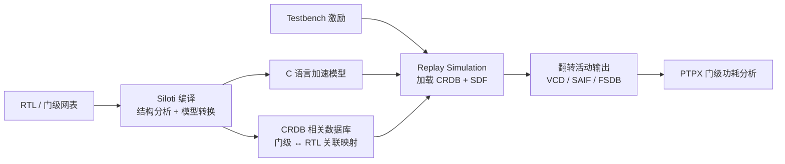

# 仿真加速与 CRDB（Siloti）

仿真加速（Simulation Acceleration）是通过将 RTL 或门级网表转换为高速执行模型来提升仿真吞吐率的方法论。动机来自验证与功耗分析的共同瓶颈：门级仿真比 RTL 仿真慢 10-100 倍，而功耗签核、后仿恰恰需要长仿真窗口（见 [[asic-flow/concepts/功耗分析|功耗分析]] 的窗口代表性讨论）——单纯依靠仿真器多核并行存在天花板，必须从模型执行效率入手。Synopsys 的 Siloti 是这一领域的代表性工具族（Siloti Automation / Siloti Power / Siloti Debug），核心思路是把设计编译为 C 语言加速模型，与原始 testbench 联合执行，在保持行为精度的同时大幅提升仿真速度。

**CRDB 是相关数据库（Correlation DataBase）的缩写**——Synopsys《Verdi and Siloti Tcl Reference》官方手册明确将其展开为 "correlation database (CRDB)"。它的核心内容是**门级网表与 RTL 之间的信号关联（Correlation / Gate-to-RTL Mapping）信息**：官方文档描述其用途为 "use the specified correlation database for gate/rtl mapping"，并说明 "All gate-level register signals in the loaded CRDB are mapped to RTL"。CRDB 是二进制文件（扩展名 .crdb，如 `extracted.crdb`），可由 FSDB 波形与设计信息提取生成（"Extracts the correlation database (CRDB) from the FSDB file"），也可被加载回工具（"Loads the correlation database (CRDB) from a binary file"）。它在 Siloti 加速链路中的地位，类似于 VCS 的中间编译产物、Verdi 的 KDB（Knowledge Database）之于各自的工具链——保存门级与 RTL 的映射关系，是"编译时/提取时生成、仿真时加载"的桥梁数据。用户实践中"siloti replay simulation 挂 CRDB、SDF 用 RTL 跑后仿结果"正是其典型用法：CRDB 提供门级信号到 RTL 的映射，SDF 提供门级时序行为，二者配合让加速仿真既能保持 RTL 级速度、又能反映后仿的时序精度。

## 原理：Siloti 加速模型与 CRDB

### 编译转换流程

Siloti 加速分两步：**编译期**将设计转换为加速模型并生成 CRDB；**运行期**加载 CRDB 与激励执行重放仿真（Replay Simulation）。

编译期：Siloti 分析设计的层次结构、时钟与时序关系，将 RTL/网表的可加速部分转换为 C 模型（模拟器对 C 模型的执行效率远高于事件驱动仿真），同时生成 CRDB 记录门级与 RTL 的关联映射——官方文档中 CRDB 由 FSDB 波形提取生成（`sidCRImport` 系列命令："Extracts the correlation database (CRDB) from the FSDB file"），保存为二进制 .crdb 文件（`sidCRSaveDB extracted.crdb`），仿真/调试时加载回内存（`sidCRLoadDB extracted.crdb`）；Verdi GUI 提供 "Prepare CRDB" 窗口可视化生成流程。CRDB 中的门级寄存器信号全部映射回 RTL 层次（"All gate-level register signals in the loaded CRDB are mapped to RTL"），支撑信号级分析（`sidCRAnaImport` 按 `-gate_crdb` / `-rtl_crdb` 导入数据）与数据扩展（`sidDESetup -crdbfile`）。运行期：原始 testbench 与加速模型联合仿真，CRDB 被加载用于解释模型行为并支持信号访问。

### Replay Simulation 与 SDF 挂载

重放仿真（Replay Simulation）指用已有的激励序列在加速模型上重新执行，快速获得结果与活动数据。关键技巧是**用 RTL 跑后仿结果**：加速模型保持 RTL 级的仿真速度，同时挂载 SDF（Standard Delay Format, 标准延迟格式）反映门级时序行为——CRDB 负责把 RTL 层次信号映射到 SDF 反标目标，SDF 提供时序延迟。这让"带时序的后仿"摆脱了门级事件驱动仿真的速度枷锁，是 Siloti 加速在功耗分析中的核心价值。

### CRDB 在流程中的三个作用

1. **门级到 RTL 的关联映射（Correlation）**：CRDB 的核心内容——门级网表信号（寄存器、线网）映射回 RTL 层次/信号名，使门级仿真、门级波形调试仍以 RTL 视角进行（Verdi 断点、源码联动），这也是其名称"相关数据库"的由来
2. **信号分析与数据扩展支撑**：门级信号与 RTL 的关联关系支撑信号级分析（`sidCRAnaImport` 从 CRDB 导入门级/RTL 信号数据）和大时间窗口的数据扩展（`sidDESetup -crdbfile`），是 Siloti 功耗分析加速（长窗口活动数据）的数据基础
3. **时序与后仿支持**：与 SDF 挂载配合，支撑"RTL 速度 + 门级时序"的重放仿真——CRDB 负责把门级信号映射到 RTL 视角，SDF 提供时序延迟

### 与 VCS / Verdi 生态的关系

VCS 是仿真执行引擎，Verdi 是调试与波形分析工具（其自身有 elaboration 数据库 KDB），Siloti 是加速编译层——三者同属 Synopsys 验证生态但分工不同：VCS 编译并执行仿真，Siloti 在 VCS 流程中插入加速模型转换，Verdi 通过 CRDB/KDB 提供 RTL 视角的调试。波形层面 Verdi 以 FSDB 为主流格式，加速仿真产出的活动数据（VCD/FSDB）可直接进入功耗分析链路。

## 功耗分析加速（衔接 PTPX）

Siloti 加速在功耗分析中的价值闭环：门级功耗分析（[[asic-flow/concepts/功耗分析|功耗分析]] 的 PTPX 章节）依赖 VCD/FSDB 活动数据，而活动数据的代表性取决于仿真窗口长度——门级事件驱动仿真跑不动长窗口，功耗峰值可能被漏掉（签核低估 20%-40% 的根源）。Siloti 加速用 C 模型把窗口拉长一个数量级以上，产出的活动数据更接近真实工作负载，再交给 PTPX 做 NLPM 精确计算。**加速仿真解决"活动数据从哪来"的吞吐瓶颈，PTPX 解决"功耗算得多准"的计算精度**——二者是功耗仿真链路的上游与下游。

## CRDB 的典型使用场景

**后仿加速**：门级后仿（含 SDF 反标的时序仿真）是最慢的仿真模式——事件驱动仿真器要处理每个门的延迟事件。挂载 CRDB + SDF 的 Replay Simulation 用加速模型替代门级事件处理，把后仿吞吐率提升一个数量级以上，回归测试的时序验证窗口得以扩大。

**功耗分析活动数据生成**：功耗签核需要覆盖峰值窗口的长仿真，而峰值窗口（如 CPU 基准测试、最大吞吐场景）恰恰是门级仿真最跑不动的地方。加速仿真以 RTL 速度产生带时序精度的翻转活动（VCD/FSDB），是"窗口代表性"与"仿真时间"矛盾的工程解。

**调试与回归**：CRDB 的信号映射让加速仿真中的调试仍以 RTL 视角进行（Verdi 断点、波形查看不因加速而失焦）；加速模型的可复用性支持同一 CRDB 在多轮回归中复用，减少重复编译开销。

## 加速仿真的局限与注意事项

1. **模型保真度**：C 模型对 RTL 行为的等价性依赖编译转换的正确性——转换覆盖不到的构造（部分时序敏感逻辑、X 传播行为、异步交互）可能退化为行为模型，保真度下降
2. **时序精度**：加速仿真的时序精度由挂载的 SDF 决定，SDF 版本兼容（1.0/2.1/3.0）与反标完整性直接影响"用 RTL 跑后仿结果"的可信度
3. **调试复杂度**：加速模型的执行路径与事件驱动仿真不同，X 传播、竞争冒险等行为可能与标准仿真器有差异，需要交叉验证
4. **工具链耦合**：Siloti/CRDB 与 VCS、Verdi、SDF 工具链强耦合，流程迁移到其他仿真器生态时加速资产不可复用
5. **适用边界**：加速收益随设计规模与可加速逻辑占比变化，小规模设计或加速覆盖率低的设计收益有限——是否引入加速需要先做收益评估

## 验证生态中的数据库分工

验证工具链中"编译时生成、运行时加载"的数据库不止 CRDB 一种，容易混淆，对比区分：

| 数据库 | 所属工具 | 生成时机 | 内容与用途 |
|:---|:---|:---|:---|
| CRDB | Verdi/Siloti（相关数据库） | 由 FSDB + 设计提取（sidCRImport） | 门级↔RTL 信号关联（Gate-to-RTL Mapping），支撑调试、信号分析、加速后仿 |
| KDB | Verdi（调试） | VCS 编译时（-kdb 选项） | 设计的 elaboration 信息，支撑 Verdi 的 nWave/源码联动调试 |
| FSDB | Verdi/VCS（波形） | 仿真运行时 | 信号波形数据，调试与功耗分析的活动载体，也是 CRDB 的提取来源 |
| simv | VCS（编译） | VCS 编译时 | 编译生成的仿真可执行文件 |

分工边界：**CRDB 服务加速执行，KDB 服务调试视图，FSDB 服务波形数据，simv 是可执行产物**——四者出现在验证链路的不同阶段，各司其职。

## 关键要点

- **CRDB = Correlation DataBase（相关数据库）**：官方手册明确定义，核心内容是门级网表与 RTL 的信号关联映射（Gate-to-RTL Mapping），二进制 .crdb 文件，由 FSDB 提取生成（sidCRImport/sidCRSaveDB）、仿真时加载（sidCRLoadDB）
- **Replay 挂 CRDB + SDF 实现"RTL 跑后仿"**：加速模型保持 RTL 速度，SDF 提供门级时序，CRDB 提供映射桥梁
- **加速仿真解决窗口瓶颈**：门级仿真慢 10-100 倍是功耗峰值窗口选不准的根源，C 模型加速把可仿真窗口拉长一个数量级以上
- **与 Verdi KDB 分工不同**：KDB 是 Verdi elaboration 的设计数据库，CRDB 是门级↔RTL 关联数据库，同为各自工具链的"生成后加载"桥梁——且 CRDB 本身由 FSDB 提取生成，两者与 FSDB 是"波形 → 关联 → 调试"的链条关系
- **与 PTPX 是上下游关系**：Siloti 产出活动数据（VCD/SAIF/FSDB），PTPX 做 NLPM 功耗计算——一个解决吞吐，一个解决精度

## 与其他概念的关系

- [[asic-flow/concepts/功耗分析|功耗分析（Power Analysis）]] — 加速仿真为功耗分析提供更长窗口、更有代表性的 VCD/SAIF/FSDB 活动数据，是功耗仿真流程的上游加速器
- [[asic-flow/concepts/功耗分析|PTPX 详解]] — PTPX 是加速产生活动数据的下游消费者，加速仿真 + PTPX 构成"长窗口活动 + 高精度计算"的功耗分析组合
- [[verification/功能验证|功能验证（Verification）]] — 仿真加速提升验证吞吐率，CRDB 支持以 RTL 视角调试加速模型，是验证效率与功耗分析的交叉技术
- [[rtl-design/RTL设计|RTL 设计（RTL Design）]] — 加速模型的编译对象是 RTL/网表，RTL 编码风格影响可加速性与模型转换质量
